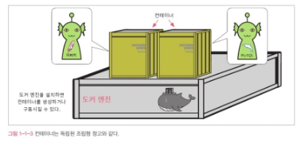

# 도커란 무엇인가?

## 도커란 무엇인가?

### 도커의 정체
* 도커 : <u>**데이터 또는 프로그램의 격리시키는 기능**</u>을 제공하는 소프트웨어
    * 아파치, MySQL 등의 여러 프로그램과 데이터를 운영체제(비슷한 것) 통째로 각각 독립된 환경에 격리하는 기능을 제공한다.
    * 주로 서버에 사용됨.
    

* 컨테이너 : 서버 상의 환경을 마치 코스트코에서 판매하는 조립형 창고 같은 작은 방으로 분할한 것. 
    * 이렇게 작게 쪼갠 독립된 창고에 데이터나 프로그램을 둔다. (조립형 창고 == 컨테이너)
* 도커 : 위의 컨테이너를 다루는 기능을 제공하는 소프트웨어
* 도커 엔진 : 도커 소프트웨어의 본체(=도커 엔진)
    * 도커를 사용하려면 도커 소프트웨어의 본체(=도커 엔진)를 설치해야 한다.
    * 도커 엔진을 사용해 컨테이너를 생성하고 구동시킬 수 있다.
    

* 컨테이너를 만드려면 이미지가 필요함.
    * 컨테이너를 만들기 위해
        * 도커 엔진이 있어야 컨테이너를 만들 수 있다.
        * 도커 엔진 외에도 컨테이너의 빵틀과도 같은 역할을 할 **이미지**가 필요하다.
* 이미지 종류 : 담고 있는 s/w 종류에 따라 다양한 이미지를 사용함.
    * ex. 아파치 컨테이너를 만들기 위해서는 아파치 이미지, MySQL 컨테이너를 만드려면 MySQL 이미지
* 컨테이너는 여러개를 만들 수 있으며, 용량이 허락하는 한 하나의 도커에서 여러 개를 만들 수 있다.
    

* 도커는 리눅스 컴퓨터에서 사용한다.
    * 도커를 사용할 수 있는 제약사항 : 종류와 상관없이 리눅스 OS가 필요함. (윈도우, macOS에서도 도커를 구동할 순 있지만 **내부적으로 리눅스가 사용된다.**)
    * **컨테이너에서 동작시킬 프로그램도 리눅스용 프로그램**이다.
      

### 데이터나 프로그램을 독립된 환경에 격리해야 하는 이유
* 대부분의 프로그램은 프로그램 단독으로 동작하는 것이 아니라 어떤 실행 환경이나 라이브러리, 다른 프로그램을 이용해 동작한다.
    * ex 1. 워드프레스는 MySQL DB를 따로 갖추지 않으면 사용할 수 x
    * ex 2. 다른 프로그램과 특정한 폴더 또는 디렉토리를 공유하거나 같은 경로에 설정 정보를 저장하는 경우도 있다.
    * => 이 때문에 하나를 업데이트하면 다른 프로그램에도 영향을 미치게 된다. (**프로그램 간 공유의 문제**)

### 프로그램의 격리란? 
* 도커 컨테이너는 다른 컨테이너와 완전히 분리된 환경이다.
    * => 즉, 컨테이너 안에 들어있는 프로그램은 다른 프로그램과 격리된 상태가 된다.
    * => 그러므로 여러 프로그램이 한 서버에서 실행되면서 발생하는 문제를 대부분 해결할 수 있다.

  

## 서버와 도커 

### 서버의 2가지 의미
* 도커는 서버에서 사용되는 소프트웨어이다.

* 서버란? : **어떤 서비스를 제공하는 것**
    * 기능적 의미의 서버 : **'무슨무슨 서버'라는 말은 '무슨무슨 기능을 제공한다'는 의미**
        * ex. 웹 서버(웹 기능을 제공함.), 메일 서버(메일 기능을 제공함.)
    * 물리적 컴퓨터로서의 서버 : 실물

* **서버의 기능은 소프트웨어가 제공하는 것**으로, 소프트웨어를 설치하면 '서버'의 기능을 갖게 된다.
    * **여러 가지 소프트웨어를 한 컴퓨터에 설치할 수도 있다.**

* 서버의 예시 : 웹 서버, 메일 서버, DB 서버, 파일 서버, DNS 서버(IP 주소와 도메인을 연결), DHCP 서버(IP 주소를 자동으로 할당하는 기능을 제공), FTP(FTP 프로토콜을 사용해 파일 송수신 기능을 제공하는 서버), 프록시 서버(통신을 중계하는 역할), 인증 서버(사용자 인증)

* 서버의 OS : 주로 리눅스가 사용됨 (ex. Red Hat, CentOS, Ubuntu, Debian)

### 컨테이너를 이용해 여러 가지 서버 기능을 안전하게 함께 실행하기
* 도커 환경에서 컨테이너를 사용하면 프로그램을 완전히 격리시킬 수 있다.
    * 그렇다면 한 대의 서버에서 웹 서버, 메일 서버, 시스템과 DB 서버를 각각 독립적인 환경에서 안전하게 운용할 수 있다. 또한 무엇을 업데이트하더라도 서로 영향을 미치지 않을 것이다.
    * 일반적으로는 한 대의 서버 컴퓨터에는 웹 서버를 한 벌(아파치 한 벌)밖에 실행하지 못한다. 하지만 컨테이너 기술을 활용하면 여러 개의 웹 서버를 올릴 수 있다.
    * 물리 서버 한 대에 여러 개의 웹 서버를 띄우면 그만큼 물리 서버 수를 줄일 수 있다.
        * 만약 컨테이너 기술을 활용하지 않고 물리 서버 한 대에 두 웹 서버를 함께 올린다면 서로 간의 환경을 건드리게 될 수도 있고, 아파치는 서버 한 대에 하나만 올릴 수 있어서 한계가 있다.
        * 컨테이너 기술을 이용 시, 개발환경을 갖추거나 운영 환경으로 쉽게 넘어갈 수 있는 것으로 **쉽게 옮길 수 있다**라는 특성을 가진다.

### 자유로이 옮길 수 있는 컨테이너
* 컨테이너 옮기기 : 컨테이너 자체를 옮긴다 보다는 컨테이너의 정보를 내보내기한 다음, 다른 도커 엔진에서 복원하는 형태(도커 엔진에서 다른 도커 엔진으로 옮기기는 쉬움.)
    * 장점 : 똑같은 상태로 튜닝한 컨테이너를 팀원 전원에게 배포해 모두가 동일한 개발환경을 사용할 수 있다.
    * => 즉, 도커를 이용하면 **물리적 환경의 차이, 서버 구성의 차이를 무시할 수 있어서** 운영 서버와 개발 서버의 환경 차이로 인한 문제를 원천적으로 방지 할 수 있다.

### 도커와 가상화 기술의 차이
##### 도커와 가상화 기술의 차이
* 도커 : '실행 환경을 독립적으로 격리한 컨테이너'
* 가상화 기술 : 가상의 물리서버를 만들기(메인보드,CPU, 메모리 등의 물리적인 부품을 소프트웨어로 구현하는 것) ex. VirtualBox, VMware
    * 차이
        * 도커 : 컨테이너에서 리눅스가 동작하는 것처럼 보이지만 실제 리눅스가 동작하는 것은 아니다. OS 기능 중 일부를 호스트 역할을 하는 물리 서버에 맡겨 부담을 덜어 둔 형태.
        * 가상화 : 실질적으로 물리 서버와 동등한 것이므로 OS도 아무것이나 설치 할 수 있고, 그 위에서 어떤 sw를 구동해도 무방함.
         => 즉, 컨테이너는 OS일부 기능을 호스트 컴퓨터에 의존하기 때문에 물리 서버에도 리눅스 기능이 필요하고, 컨테이너의 내용도 리눅스 OS가 될 수 밖에 없다. 
> 메인모드, CPU, 메모리 : 컴퓨터를 구성하는 가장 기본적인 부품

##### 도커와 AWS EC2
* EC2 : 가상화 기술로 '인스턴스'라는 개념이 있음.
    * 각각의 인스턴스가 완전히 독립된 컴퓨터처럼 동작함.
    * 다만 인스턴스는 컨테이너와 마찬가지로 AMI라는 이미지로부터 생성하므로 인스턴스를 배포하는 방법은 도커와 비슷함.

##### 도커와 호스팅 서비스
* AWS ECS가 이에 해당하며, 이들 서비스를 사용하면 별도로 가상 서버를 만들지 않아도 컨테이너 이미지를 그대로 실행할 수 있다.