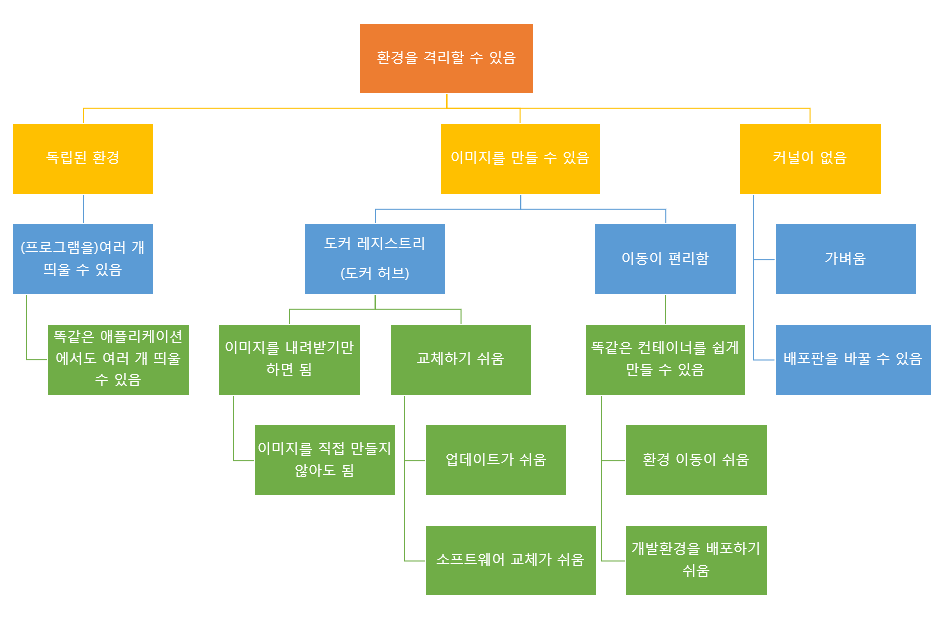

# 도커의 동작원리

## 도커의 동작 원리

### 도커의 구조
* OS -> 도커 엔진 -> 컨테이너 순으로 동작한다. (프로그램이나 데이터는 컨테이너 안에 위치함.)

* 운영체제 : 소프트웨어나 프로그램의 명령을 하드웨어에 전달하는 역할
    * 구성 요소 : 커널(: 하드웨어를 다룸) + 그 외의 주변 부분(: 주변 부분이 프로그램의 연락 내용을 커널에 전달)
    * 전달 구조 : 소프트웨어 -> 주변 부분 -> 커널 -> 하드 웨어

* 도커 엔진 아래에도 리눅스 OS가 있는데, 컨테이너 속에 또 리눅스 OS(비슷한 것)이 있다. (도커의 가장 큰 특징 중 하나)
    * 모든 컨테이너에는 '리눅스 운영체제 비슷한 무언가'가 들어있다.
    * 도커에서는 컨테이너가 완전히 분리되어 있어서, 밑바탕이 되는 리눅스 OS의 주변 부분이 컨테이너 속 프로그램의 명령을 전달받을 수 없다. 따라서 **컨테이너 속에 OS의 주변 부분이 프로그램의 명령을 전달받고 이를 밑바탕이 되는 커널에 전달하는 구조**로 되어 있다.
        * 전달 구조 : 도커 -> 컨테이너 내의 리눅스의 주변 부분 -> 도커 엔진 -> 커널 -> 하드 웨어
    * 리눅스 OS 전체를 컨테이너 속에 넣는 것이 아니라 주변 부분만 컨테이너에 넣고 커널은 밑바탕에 있는 것을 빌려 쓰는 형태 : 가벼움(도커의 가장 큰 특징)을 얻을 수 있다.

### 도커는 기본적으로 리눅스 OS에서만 동작한다.
* 이유 : **도커는 밑바탕에서 리눅스 운영체제가 동작하는 것을 전제로 하는 구조로 되어 있어서**
    * 또한 컨테이너 안에 들어있는 주변 부분도 이에 맞춰 리눅스 OS의 주변 부분이어야 한다.
    * 컨테이너에서 실행할 소프트웨어(프로그램) 역시 리눅스용 소프트웨어여야 한다.
* 도커는 리눅스 컴퓨터에 독립된 격리 환경을 만드는 것이며, 리눅스에서만 동작하고, 컨테이너에서 동작할 프로그램도 리눅스용 프로그램이다.

* 윈도우와 macOS에서 도커 구동하기
    * 방법 1 : virtualBox나 VMware 같은 가상 환경 위에 리눅스 OS를 설치하고 그 위에서 도커를 실행
    * 방법 2 : 윈도우용 또는 macOS용 도커 데스트톱처럼 도커를 실행하는데 필요한 리눅스 OS를 포함하는 패키지를 설치해 사용
    * => 도커를 사용하려면 어떤 형태로든 리눅스 OS를 갖춰야한다.

  

## 도커 허브와 이미지, 그리고 컨테이너
* 이미지 : 컨테이너를 만드는 '빵틀'같은 것
* 도커 허브 : 인터넷 상에 도커 이미지를 모아놓은 곳
* 도커의 장점은 도커 허브와 도커 이미지에서 기인하는 바가 크다.

### 이미지와 컨테이너
* 이미지 : 컨테이너를 만드는 '빵틀'같은 것으로, 컨테이너의 설계도 역할을 한다. => 즉, **이미지는 컨테이너를 만드는 데 사용**한다.
    * 실제 사용하는 것은 컨테이너이며, 이미지를 그대로 사용하는 일은 없다.
    * 하나의 이미지로 동일한 컨테이너를 여러 개 만들 수 있다.

* 컨테이너로도 이미지를 만들 수 있다.
    * 이는 즉, 이미 만든 컨테이너에 손을 대서 이미지를 새롭게 만드는 과정이다. => 이런 새로운 이미지로 '개조된' 컨테이너를 대량으로 만들 수 있다
    * ex. 소프트웨어나 시스템을 넣은 새로운 이미지를 만들면 다수의 서버를 준비하는 작업이 매우 간단해짐

* 도커 엔진 간에 이동이 가능하다.
    * 동일한 컨테이너를 여러 개 만들지 않더라도 이러한 특성을 이용해 다른 물리 서버에 설치된 도커 엔진으로 컨테이너를 이동시킬 수 있다.
    * 컨테이너는 도커 엔진만 설치되어 있으면 구동이 가능하다.
    * 컨테이너 자체가 이동하는 것은 아니지만 이미지를 통해 컨테이너가 이동한 것과 같은 효과를 얻을 수 있다.

### 도커 허브와 도커 이미지
* 이미지는 주로 '도커 허브'에서 구하게 된다.
    * 도커 허브 : 공개된 컨테이너 이미지가 모여있는 곳으로, 원하는 컨테이너의 이미지를 내려받을 수 있다.
    * 공식적으로 운영되는 도커 레지스트리(도커 이미지를 배포하는 서비스)의 이름
    * [http](https://hub.docker.com/)

* 도커 허브에는 어떤 이미지가 공개되어 있는가?
    * OS(비슷한 것)만 들어 있는 이미지, 여러 가지 sw가 함께 포함된 것까지 다양한 이미지가 제공됨. (ex. OS(비슷한 것), OS(비슷한 것)+아파치, OS(비슷한 것)+아파치+MySQL, 아파치, MySQL, nginx, postgreSQL)

* 안전한 컨테이너 이미지를 고르는 법
    * 공식 이미지를 사용한다
    * 커스텀 이미지를 직접 만들어 사용한다.

* 다양한 형태로 조합이 가능한 컨테이너
    * 도커를 사용할 때의 원칙 중 하나 : 한 컨테이너에 한 프로그램 (: 하나의 프로그램만 담긴 컨테이너를 사용한다는 의미. why? 보안 및 유지 관리 측면에서 유리하기 때문에 많이 쓰이는 정책이다.)

  

## 도커 컨테이너의 생애주기와 데이터 저장

### 도커 컨테이너 : 쓰고 버리는 일회용품
* 컨테이너 : 쓰고 버리는 일회용품 같은 것
    * 컨테이너는 쉽게 만들 수 있어서 새로운 버전이 나오면 새로운 컨테이너로 갈아타는 것이 좋다.
    * 이것이 가능한 이유 : 컨테이너는 일반적으로 여러 개를 동시 가동하는 상황을 전제로 하기 때문에
* 컨테이너의 생애주기 : 컨테이너를 **만들고** -> **실행하고** -> **종료하고** -> **폐기하는** 과정

### 데이터 저장
* 도커가 설치된 물리적 서버(호스트)의 디스크를 마운트해 이 디스크에 데이터를 저장한다. (설정파일도 마찬가지)
    * 컨테이너 폐기 시 해당 컨테이너 안에서 편집했던 파일은 사라지는 일을 방지하기 위해서
        * 폐기 전 중요한 데이터가 컨테이너에 있는지 확인은 해야함.
    > 마운트 : 디스크를 연결해 데이터를 기록할 수 있도록 한 상태 (ex. 외장 USB메모리나 HDD를 연결하는것)
    * 최악의 경우 도커 엔진 자체에 무슨 일이 생기더라도 데이터는 그대로 보존된다.
    * 장점 : 다른 컨테이너와 데이터를 공유할 수 있어 편리하다.

  

## 도커의 장점과 단점
### 도커의 구조와 성질
* 도커의 성질
    
    * 핵심 성질 : **환경을 격리할 수 있다**
        * 이 성질 덕분에 **"독립된 환경", "이미지를 만들 수 있다", "컨테이너에 '커널'을 포함시키지 않아도 되는"** 구조가 가능함.

### 도커의 장점과 단점
* 장점 : **'여러개', '이동성', '생성', '보안'**
    1. 한 대의 물리 서버에 여러 대의 서버를 띄울 수 있다.
        * 컨테이너에는 커널이 포함되지 않아 물리 서버의 OS에 의존한다. 그래서 소프트웨어적으로 하드웨어를 재현하는 가상화 기술에 비해 압도적으로 가볍다.
    2. 서버 관리가 용이하다.
        * 각 sw을 독립된 환경에 격리하므로 다른 sw에 영향을 끼지 않음.
        * 환경 이전도 간단함.
    3. 서버 고수가 아니어도 다루기 쉽다.
        * 터미널에 명령을 직접 입력해야 한다는 것 외에는 장애물이 없음.

* 단점 
    1. 리눅스용 sw밖에 지원하지 않는다.
    2. 물리 서버 한 대에 여러 대의 서버를 띄우는 형태이므로 호스트 서버에 문제가 생기면 모든 컨테이너에 영향이 미친다.
    3. 컨테이너를 여러 개 사용하는 형태를 가정하므로 컨테이너 하나를 장기간에 걸쳐 사용할 떄는 그리 큰 장점을 느끼기 어렵다.
        * 애초에 도커를 사용하려면 반드시 도커 엔진을 구동해야 하는데, 컨테이너를 하나밖에 사용하지 않는다면 도커 엔진이 단순한 오버헤드에 지나지 않기 때문이다.

### 도커의 주 용도
1. 팀원 모두에게 동일한 개발환경 제공하기(= 동일한 환경을 여러 개 만들기)
    * 컨테이너는 운영환경과 개발환경의 차이가 근본적으로 사라짐.
2. 새로운 버전의 테스트(= 격리된 환경을 이용)
    * 새로운 버전을 먼저 개발환경에서 테스트한 후 운영환경에 적용할 때도 컨테이너를 활용할 수 있음.
3. 동일한 서버가 여러 대 필요한 경우(= 컨테이너 밖과 독립된 성질을 이용)
    * 컨테이너를 이용해 한 대의 쿨리 서버에 똑같은 서버를 여러개 만들기 => 관리 간편, 비용 절약

##### 도커에 대한 오해
* 도커 컨테이너 속 파일은 날아가기 쉬운 것이 아니라, '명시적으로 지우는 경우가 많다'