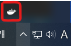
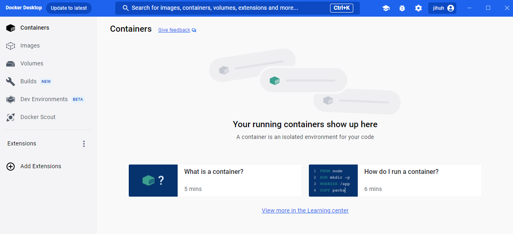
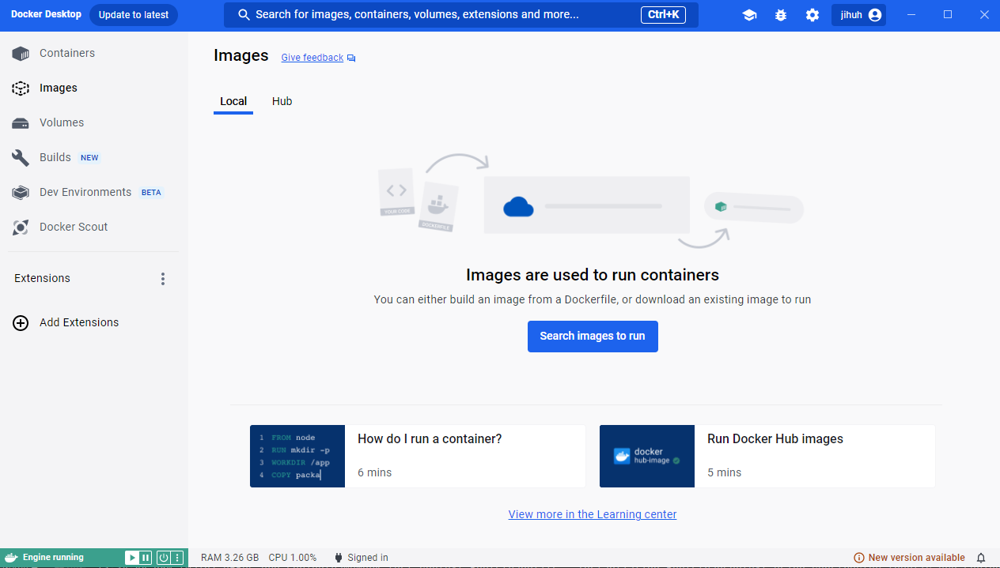
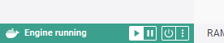
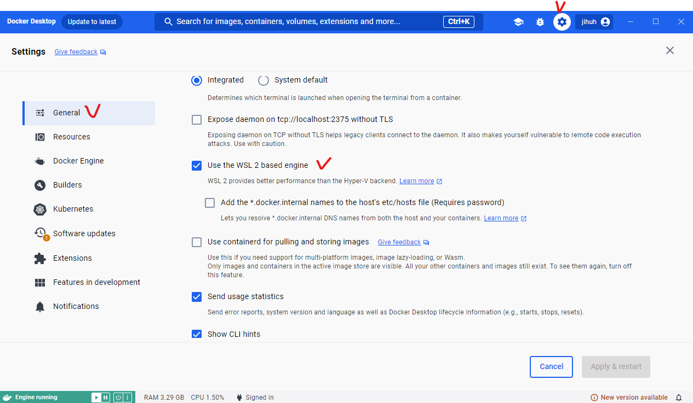

# 도커를 사용해보자
1. 도커 설치
2. 기본적인 조작 방법

## 도커를 사용하려면 

### 도커는 기본적으로 리눅스용이지만 윈도우와 macOS에서도 사용할 수 있다.
* 도커를 사용하려면 **도커 엔진이라는 무료 sw를 설치**해야 한다.
* 도커 엔진을 설치하려면 기본적으로 리눅스 OS가 필요하지만 윈도우와 macOS에서도 사용할 수 있는 방법이 있다.

* 도커 환경을 구축하는 3가지 방법
    1. 리눅스 컴퓨터에서 도커 사용하기
    2. 가상 머신이나 렌탈 환경에 도커를 설치하고 윈도우나 macOS를 통해 사용하기
    3. 윈도우용/macOS용 도커 사용하기

### 윈도우용/macOS용 도커 사용하기 (도커 데스크톱)
* 도커 데스크톱 : 리눅스 OS 등의 실행환경도 묶은 패키지
    * 종류
        * 윈도우용 : 도커 엔진 + 리눅스 OS
        * macOS용 : 도커 엔진 + 리눅스 OS + 가상환경(Hyper-Kit)
    * 구조 : 사용자에게는 보이지 않는 가상의 리눅스 환경을 만들고 이 환경에서 도커 엔진을 구동하는 구조
    * '가상 머신이나 렌탈 환경에 도커를 설치하고 윈도우나 macOS를 통해 사용하기'와의 차이 : 가상화 부분
        * 2번 방법 : 사용자가 명시적으로 가상화 sw를 설치하고 그 위에 리눅스 OS를 설치한 다음 여기에 도커 엔진을 설치하는 방법으로 구축함. (VirtualBox, VMware 같은 sw 사용)
        * 3번 방법(도커 데스크톱) : 사용자가 가상화 환경이나 리눅스 OS를 신경 쓰지 않고도 도커를 사용할 수 있음. (Hyper-V는 윈도우에 포함, HyperKit은 도커 데스트톱 패키지에 포함)

* 도커 데스크탑은 일반적인 소프트웨어처럼 사용한다.
    * 도커 데스크탑의 장점 : 설치가 간편, 도커를 사용하면서 가상화 sw나 리눅스 os의 존재를 신경쓰지 않아도 된다.

* 운영체제가 2개지만 따로 신경쓰지 않아도 된다.
    * 도커가 전용으로 사용하는 숨겨진 운영체제와 같아서

* 도커 데스크톱을 사용하기 위한 조건과 도커 데스크톱이 불안정한 이유
    * 윈도우에서의 조건 : Hyper-V(윈도우용 가상환경)가 활성 상태여야 한다.
    * 도커 데스크톱이 불안정해지는 증상 : 매우 느려지거나 VirtualBox 또는 VMware 같은 가상화 소프트웨어와 충돌을 일으키는 경우
        * 원인 : 도커 데스크탑을 실행하는 가상환경(Hyper-V)이 불안정해 일어나는 문제
        * 해결 : 윈도우 및 가상화 소프트웨어를 모두 최신으로 업데이트하면 버그가 해결되겠지만, 버전에 따라 충돌이 일어날 가능성이 있음.

##### WSL2란?
* WSL2(Windows Subsystem for Linux 2) : 윈도우에서 리눅스 소프트웨어를 실행하기 위한 기능
    * 이 기능으로 모든 윈도우 10 사용자가 도커 데스크톱을 사용할 수 있게 됨.
    * 도커 데스크톱의 종류
        1. 도커 제작사에서 만든 리눅스 OS를 사용하는 버전
        2. 마이크로소프트에서 만든 WSL2를 사용하는 버전(추천) 
            * 도커 관리 화면에서 WSL2 엔진을 사용하는 것으로 설정가능

### 도커를 실행하기 위한 조건
* 조건 : 64비트 운영체제, 메모리 4GB 이상, WSL2 사용 가능&Hyper-V 및 Containers가 활성화(윈도우)
    * 확인 방법
        * 윈도우 : 윈도우-"설정"-"시스템"-"정보"에서 "64비트 운영체제", "x64기반 프로세서"인지 확인
        * mac : 사과마크 클릭-"이 max에 관하여"-"프로세서"

<br/><br/>

## 도커 설치
* 윈도우 : GUI(그래픽을 통해 조작 가능한 인터페이스) 이용
* 리눅스 : CUI(명령을 직접 키보드로 쳐서 입력하는 사용자 인터페이스) 이용

### 윈도우용 도커 데스크톱 설치(WSL2 사용 기준)
0. 윈도우를 최신 버전으로 업데이트
1. '시작 메뉴'-'제어판'-'프로그램'-'프로그램 및 기능'-'Windows 기능 켜기/끄기' 클릭
2. 'Linux용 Windows 하위 시스템'과 '가상 머신 플랫폼' 기능 체크
3. (기능 활성을 위한)재시작
4. 리눅스 커널 다운로드 및 업데이트 : (wsl update download 검색) https://wslstorestorage.blob.core.windows.net/wslblob/wsl_update_x64.msi
5. 윈도우용 도커 데스크톱 내려받기 : https://docs.docker.com/desktop/setup/install/windows-install
6. "Docker Desktop Installer" 실행
7. 환경 확인 : 설정의 모든 항목에 체크 후 OK 클릭
8. 설치 후 "click and log out" 버튼을 통해 윈도우에 다시 로그인


* 실행 확인
    1. "Docker Desktop" 아이콘 클릭(도커 데스크톱 실행)
    2. 태스크 트레이를 열러 고래 아이콘이 나타났는지 확인
        
    3. 튜토리얼 건너띄기

##### 도커를 실행하면 컴퓨터가 느려진다?
* 설치가 끝나면 도커는 상주 실행 상태가 된다.
* 하지만 컨테이너를 실행하지 않았다면 컴퓨터가 느려지는 일이 없디.

### 도커 데스크톱의 화면 확인
* [Containers/Apps] 탭 : 실행중인 컨테이너의 목록
    
* [Images] 탭 : 내려받은 도커 이미지의 목록
    
* 도커 실행 중 여부 확인 : 화면 왼쪽 아래의 마크 색상(녹색)
    
* 도커 설정 확인 : "setting"
* WSL2에서 동작하는지 여부를 확인
    
    * "settings" - "General" - "use the WSL2 based engine"이 체크되어있는지 확인하기
    * 체크를 해제하면 도커 엔진이 Hyper-V를 통해 동작한다.

<br/><br/>

## 도커의 조작 방법과 명령 프롬프트 및 터미널 실행
### 도커는 명령 프롬프트 또는 터미널에서 다룬다.
* CUI(명령을 입력하는)을 사용해 도커를 다룬다.
    * 윈도우 : 명령 프롬프트
    * macOS : 터미널
> 터미널 소프트웨어 : 컴퓨터에 명령을 전달하는 소프트웨어

* 명령어를 이용한 컨테이너 실행
    * 실행 : ```docker run ContainerName```
    * 중지 : ```docker stop ContainerName```

* 서버에서 도커를 사용중이라면 도커엔진 종료 시 모든 컨테이너가 종료되므로 주의할 것 

##### 리눅스에 도커 설치
> * 설치 관련된 도커 공식 웹사이트 : https://docs.docker.com/engine/install/
> * 도커 설치 (우분투) : https://docs.docker.com/engine/install/ubuntu/
1. 설치에 필요한 소프트웨어를 설치
    ```cmd
    sudo apt-get install ca-cerificated curl gnupg lsb-release
    ```
    * ca-cerificated : 인증서 관련 모듈
    * curl : HTTP 등을 통해 파일을 내려받기 위한 모듈
    * gnupg : 디지털 서명을 사용하기 위한 모듈
    * lsb-release : 리눅스 배포판을 식별하는 데 이용되는 모듈

2. PGP 키 추가 : 서명 키로 사용할 PGP 키를 추가한다. 정상적으로 키가 추가될 때 화면에 'OK'가 출력됨.
    ```cmd
    curl -fsSL https://download.docker.com/linux/ubuntu/gpg | sudo gpg --dearmor -o /user/share/keyrings/docker-archive-keyring.gpg
    ```

3. 핑거프린트 확인 : 서명이 제대로 추가됐는지 핑거프린트를 확인한다.
    ```cmd
    sudo apt-key fingerprint 0EBFCD99
    
    ## 실행 결과
    pub rsa0000 2017-02-22 [AAAA]
        9A9A 9A9A .... 9A9A
    uid [unknown] Docker Release (CE deb) <docker@docker.com>
    sub rsa0000 2017-02-22 [S]
    ```

4. 도커 리포지터리 추가
    ```cmd
    echo "deb [arch=$(dpkg --print-architecture) signed-by=/usr/share/keyrings/docker-archive-keyrings.gpg] https://download.docker.com/linux/ubuntu $(lsb_release -cs) stable" | sudo tee /etc/apt/sources.list.d/docker.list > /dev/null
    ```

5. 리포지터리 업데이트
    ```cmd
    sudo apt-get update
    ```

6. 도커 설치
    ```cmd
    sudo apt-get install docker-ce docker-ce-cli containerd.io
    ```

7. 관리자 외의 사용자도 사용할 수 있게 하기
    ```cmd
    sudo usermod -aG docker $USER
    ```

8. 설치 확인
    ```cmd
    docker --version
    ```