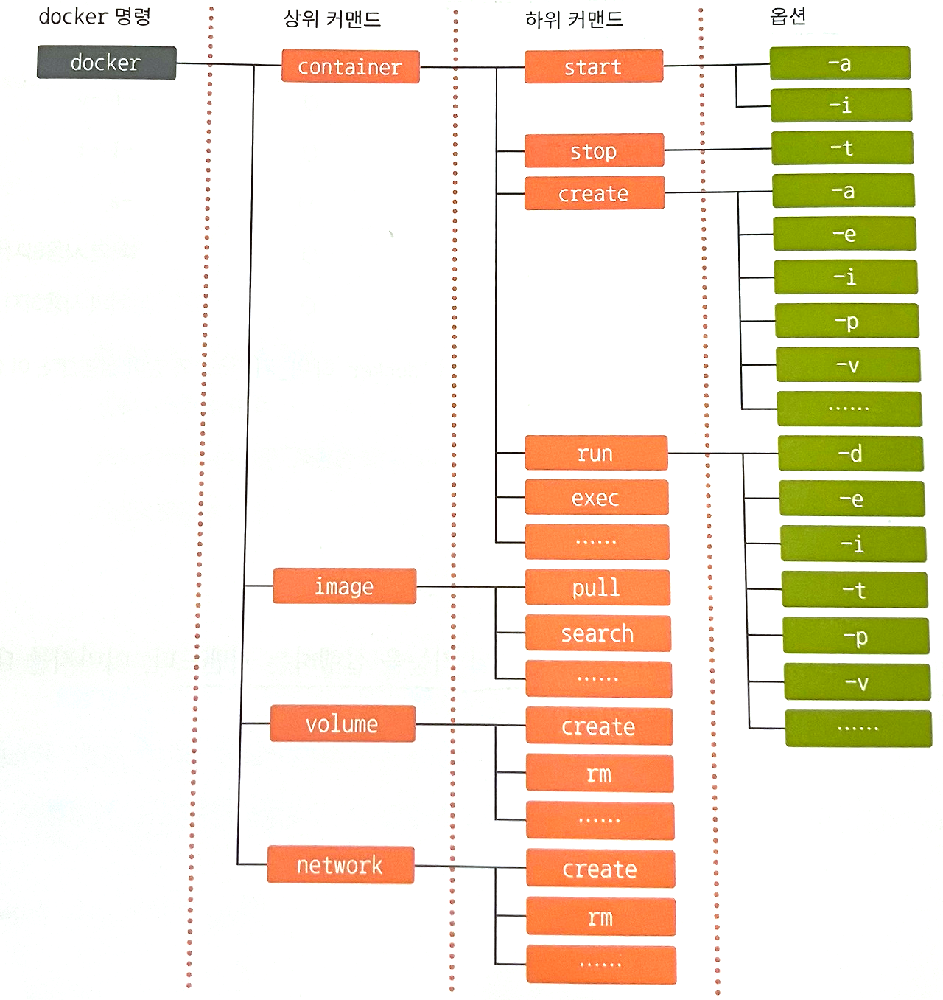
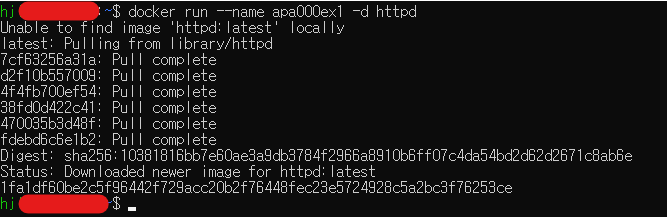
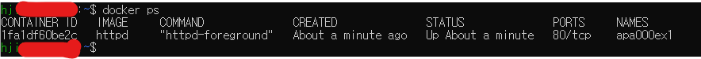
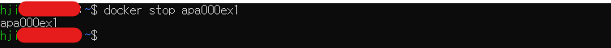
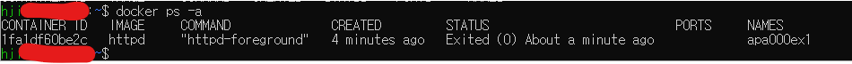
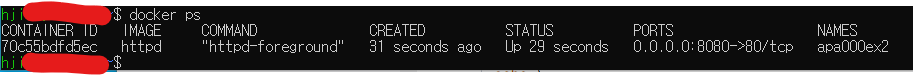
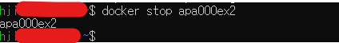

# 컨테이너를 실행해보자

## 도커 엔진 시작하기/종료하기

### 도커 엔진을 시작/종료하는 방법
* 도커 엔진은 설치와 함께 실행되며, 계속 동작상태로 남아있지만 **컨테이너를 실행 중이 아니라면 컴퓨터의 리소스를 거의 차지하지 않으므로 문제가 없다.**
* 도커 엔진은 자동 실행해두는 것이 좋다.
    * 윈도우
        1. 도커 엔진 시작 : "Docker Desktop" 클릭
        2. 도커 엔진 종료 : 도커 데스크탑 아이콘 클릭 후 "Quit Docker Desktop" 선택
        3. 자동 실행 설정 : 태스크 트레이에서 도커 데스크톱 아이콘을 클릭 후 메뉴에서 "start docker desktop when you login"에 체크
    * macOS
        1. 도커 엔진 시작 : 파인더 - "애플리케이션" 폴더 - "docker desktop" 클릭
        2. 도커 엔진 종료 : 화면 오른쪽 위에 위치한 상태 막대에서 도커를 클릭 후 "Quit Docker Desktop" 선택
        3. 자동 실행 설정 : 화면 오른쪽 위에 위치한 상태 막대에서 도커를 클릭 후 메뉴에서 "Preferences" 선택 - "start docker desktop when you login"에 체크
    * 리눅스 (root 권한 필요)
        1. 도커 엔진 시작 : ```sudo systemctl start docker```
        2. 도커 엔진 종료 : ```sudo systemctl stop docker```
        3. 자동 실행 설정 : ```sudo systemctl enable docker```

* 도커 엔진이 한번 종료되면 모든 컨테이너는 정지 상태가 된다.
    * 컨테이너에는 자동 실행 설정이 없으므로, 도커 엔진과 함께 컨테이너를 복구하려면 컨테이너를 따로 실행하는 스크립트를 작성해야 한다.

<br/><br/>

## 컨테이너의 기본적인 사용 방법
### 컨테이너 사용의 기본은 도커 명령어
* ```docker ~``` : 컨테이너 사용의 기본 명령어
* ```docker [커맨드] (옵션) [대상] (인자)``` : docker [커맨드 : [무엇을] [어떻게]] [대상]
    * 예시
        * ```docker container run aaa``` : 이름이 aaa인 컨테이너를 실행
        * ```docker image pull aaa``` : aaa라는 이미지 내려받기
        * ```docker container start aaa``` : aaa라는 이미지로 컨테이너를 start한다
        * ```docker container run -d aaa --mode=1```
            * -d : 백드라운드로 실행하라(옵션)
            * --mode=1 : 모드 1로 실행하라(인자)
    * 옵션과 인자가 붙을 수 있다.

* 커맨드
    * 관례상 'container'를 붙이지 않아도 실행 가능하다.
    * ex. ```docker container run``` => ```docker run```

* 옵션
    * 커맨드에 세세한 설정을 지정하는 용도로 커맨드의 실행방법 또는 커맨드에 전달할 값을 지정한다.
    * - 또는 -- 으로 시작하는 것이 일반적이지만 -기호를 붙이지 않는 경우도 있다. (ex. -d, --all)
    * -d처럼 -를 하나만 사용하는 옵션은 한꺼번에 모아 쓸 수 있다.(ex. -d와 -i와 -t : -dit)
    * 예시
        * -d : 백그라운드로 실행
        * -i, -t : 키보드를 통해 조작하고 싶을 때 
        * --name [옵션값]: 커맨드에 어떤 값을 전달 시 (ex. --name aaa)

* 대상 : 구체적인 이름
* 인자 : 대상에 전달할 값을 지정한다. -또는 --로 시작한다. (ex. 문자 코드, 포트 번호)
    * 예시 : --mode=1 , --style aaa

### [실습] 간단한 명령어를 사용해보자
* docker version : 도커 버전을 확인하는 명령어
* 대표적인 명령어
    

* 컨테이너 조작 관련 커맨드(상위 커맨드 : container) : 컨테이너를 다루기 위해 사용하는 커맨드
    * docker container 하위_커맨드 옵션
    * 주요 하위 커맨드 <br />
        | **하위 커맨드** | **내용**                                                                                                  | **생략 가능 여부** | **주요 옵션**                |
        |------------|---------------------------------------------------------------------------------------------------------|--------------|--------------------------|
        | start      | 컨테이너 실행                                                                                                 | O            | -i                       |
        | stop       | 컨테이너 중지                                                                                                 | O            | 거의 사용하지 않음               |
        | create     | 도커 이미지로부터 컨테이너 생성                                                                                       | O            | --name -e -p -v          |
        | run        | 도커 이미지를 내려받고 컨테이너를 생성해 실행- docker image pull + docker container create + docker container start를 합친 명령어 | O            | --name -e -p -v -d -i -t |
        | rm         | 정지 상태의 컨테이너 삭제                                                                                          | O            | -f -v                    |
        | exec       | 실행중인 컨테이너 속에서 프로그램을 실행                                                                                  | O            | -i -t                    |
        | ls         | 컨테이너 목록을 출력                                                                                             | docker ps    | -a                       |
        | cp         | 도커 컨테이너와 도커 호스트 간에 파일을 복사                                                                               | O            | 거의 사용하지 않음               |
        | commit     | 도커 컨테이너를 이미지로 변환                                                                                        | O            | 거의 사용하지 않음               |

* 이미지 조작 관련 커맨드(상위 커맨드 : image) : 이미지와 관련된 기능을 실행하는 커맨드 
    * docker image 하위_커맨드 옵션
    * 주요 하위 커맨드 <br />
        | **하위 커맨드** | **내용**                     | **생략 가능 여부** | **주요 옵션**  |
        |------------|----------------------------|--------------|------------|
        | pull       | 도커 허브 등의 레포지토리에서 이미지를 내려받음 | O            | 거의 사용하지 않음 |
        | rm         | 도커 이미지 삭제                  | docker rmi   | 거의 사용하지 않음 |
        | ls         | 내려 받은 이미지의 목록 출력           | X            | 거의 사용하지 않음 |
        | build      | 도커 이미지를 생성                 | O            | -t         |

* 볼륨 조작 관련 커맨드(상위 커맨드 : volume) : 볼륨과 관련된 기능을 실행하는 커맨드
    * docker volume 하위_커맨드 옵션
    * 주요 하위 커맨드
        | **하위 커맨드** | **내용**                | **생략 가능 여부** | **주요 옵션**  |
        |------------|-----------------------|--------------|------------|
        | create     | 볼륨을 생성                | X            | --name     |
        | inspect    | 볼륨 상세 정보를 출력          | X            | 거의 사용하지 않음 |
        | ls         | 볼륨 목록을 출력             | X            | -a         |
        | prune      | 현재 마운트되지 않은 볼륨을 모두 삭제 | X            | 거의 사용하지 않음 |
        | rm         | 지정한 볼륨 삭제             | X            | 거의 사용하지 않음 |

* 네트워크 조작 관련 커맨드(상위 커맨드 network) : 도커 네트워크와 관련된 기능
    * 도커 네트워크 : 도커 요소 간의 통신에 사용하는 가상 네트워크
    * 주요 하위 커맨드
        | **하위 커맨드** | **내용**                      | **생략 가능 여부** | **주요 옵션**  |
        |------------|-----------------------------|--------------|------------|
        | connect    | 컨테이너를 도커 네트워크에 연결           | X            | 거의 사용하지 않음 |
        | disconnect | 컨테이너의 도커 네트워크 연결을 해제        | X            | 거의 사용하지 않음 |
        | create     | 도커 네트워크를 생성                 | X            | 거의 사용하지 않음 |
        | inspect    | 도커 네트워크 상세 정보 출력            | X            | 거의 사용하지 않음 |
        | ls         | 도커 네트워크 목록 출력               | X            | 거의 사용하지 않음 |
        | prune      | 현재 컨테이너가 접속하지 않은 네트워크 모두 삭제 | X            | 거의 사용하지 않음 |
        | rm         | 지정한 네트워크 삭제                 | X            | 거의 사용하지 않음 |

* 그 밖의 상위 커맨드
    * 대부분은 도커 스웜과 관련된 커맨드
    * 그 밖의 상위 커맨드
        | **그 밖의 상위 커맨드** | **내용**                                                 |
        |------------|--------------------------------------------------------|
        | checkpoint | 현재 상태를 일시적으로 저장한 후, 나중에 해당 시점의 상태로 되돌릴 수 있음. 현재 실험적 기능 |
        | node       | 도커 스웜의 노드를 관리하는 기능                                     |
        | plugin     | 플러그인을 관리하는 기능                                          |
        | secret     | 도커 스웜의 비밀값 정보를 관리하는 기능                                 |
        | service    | 도커 스웜의 서비스를 관리하는 기능                                    |
        | stack      | 도커 스웜 또는 쿠버네티스에서 여러 개의 서비스를 합쳐 구성한 스택을 관리하는 기능         |
        | swarm      | 도커 스웜을 관리하는 기능                                         |
        | system     | 도커 엔진의 정보를 확인하는 기능                                     |

* 단독으로 쓰이는 커맨드 : 상위 커맨드없이 단독으로 쓰임
    | **단독 커맨드** | **내용**                | **주요 옵션**  |
    |------------|-----------------------|------------|
    | login      | 도커 레지스트리에 로그인         | -u -p      |
    | logout     | 도커 레지스트리에 로그아웃        | 거의 사용하지 않음 |
    | search     | 도커 레지스트리 검색           | 거의 사용하지 않음 |
    | version    | 도커 엔진 및 명령행 도구의 버전 출력 | 거의 사용하지 않음 |

<br /><br />

## 컨테이너의 생성과 삭제, 실행, 정지
### docker run, docker stop, docker rm 커맨드
* 컨테이너의 생애주기 : 이미지 내려받기-> 생성->실행->정지->폐기->이미지 폐기
    * 컨테이너를 폐기하려면 먼저 컨테이너를 정지시켜야 한다. => 동작 중인 컨테이너를 그대로 삭제할 수는 없다.
    
* ```docker run``` : 컨테이너를 생성하고 실행하는 기능. 컨테이너를 생성하려면 이미지가 필요한데, 필요한 이미지가 없다면 이미지를 내려받는 기능도 겸한다.
    * 형식 : ```docker run (옵션) [대상] (인자)```
    * run = create + start + pull
    * 주요 옵션 <br />
        |옵션 형식|내용|
        |--------|----|
        |--name 컨테이너_이름 | 컨테이너 이름을 지정함.|
        |-p 호스트_포트번호:컨테이너_포트번호 | 포트 번호를  지정함.|
        |-v 호스트_디스크:컨테이너_디렉터리 | 볼륨을 마운트함.|
        |--net=네트워크_이름 | 컨테이너를 네트워크에 연결함.|
        |-e 환경변수_이름=값 | 환경변수를 설정함.|
        |-d | 백그라운드로 실행함.|
        |-i | 컨테이너에 터미널을 연결함.|
        |-t | 특수 키를 사용 가능하도록 함.|
        |-help | 사용 방법 안내 메시지를 출력함.|
        * -p : --publish, -v : --volume, -e : --env, -d : -detach, -i : --interactive, -t : --tty

* ```docker stop``` : 컨테이너를 정지하는 커맨드
    * 형식 : ```docker stop 컨테이너_이름```
* ```docker rm``` : 컨테이너를 삭제하는 커맨드 (정지 상태가 아닐 시 오류 발생)
    * 형식 : ```docker rm 컨테이너_이름```

* ```docker ps``` : 컨테이너의 목록을 출력한다 (생략형 : ```ls```)
    * 형태 : ```docker ps (옵션)```
    * 결과 : 컨테이너ID, 컨테이너를 만들때 사용한 이미지 이름, 컨테이너의 현재 상태, 컨테이너의 이름
        
        * CONTAINER ID : 컨테이너 식별자
        * IMAGE : 컨테이너를 만들 때 사용한 이미지 이름
        * COMMAND : 컨테이너 실행 시 실행하도록 설정된 프로그램 이름
        * CREATED : 컨테이너 생성 후 경과된 시간
        * STATUS : 컨테이너의 현재 상태. 실행중이라면 Up, 종료된 상태라면 Exited
        * PORTS : 컨테이너에 할당된 포트 번호 호스트 포트 번호/컨테이너 포트 번호 형식으로 출력
        * NAMES : 컨테이너 이름
    * 옵션
        * -a : 현재 존재하는 컨테이너(정지 상태의 컨테이너를 포함)의 목록을 출력


##### 한번만 실행되는 컨테이너와 데몬 형태로 동작하는 컨테이너
* -d를 붙이지 않고 컨테이너를 실행하면 실행된 컨테이너가 프로그램의 실행을 마칠 때까지 터미널의 제어를 차지하므로 그다음 명령을 입력할 수 없는 상태가 된다. 또한 -i,-t 옵션을 붙이지 않으면 컨테이너 안의 파일 시스템에 접근할 수 없다.
* 컨테이너에는 '한 번만 실행되는 컨테이너'와 '데몬 형태로 동작하는 컨테이너'가 있다.
    * 한 번만 실행되는 컨테이너 : 실행하자마자 종료되므로 컨테이너가 터미널의 제어를 차지하더라도 일시적이라서 문제 x
    * 데몬처럼 계속적으로 실행되는 프로그램 : 저절로 종료되지 않으므로 한번 터미널 제어를 넘기면 이를 되찾아 오기가 번거롭다.
    * => 그래서 옵션은 컨테이너의 종류에 따라 필요할 수도 있고, 없을 수도 있다.
> 데몬 : 리눅스에서 동작하는 프로그램 중에서 백그라운드에서 항상 동작하는 프로그램을 관례적으로 일컫는다.

### [실습]컨테이너를 생성하고, 실행, 상태 확인, 종료, 삭제해보자
1. 컨테이너 생성 및 실행 : ```docker run --name apa000ex1 -d httpd```
    * --name apa000ex1 : apa000ex1라는 이름으로 컨테이너 생성
    * -d : 백그라운드로 실행
    * httpd : 아파치의 이미지 이름
    * 결과
        

2. 실행중인 컨테이너의 목록 확인 : ```docker ps```
    * 결과
        

3. 컨테이너 종료 : ```docker stop apa000ex1```
    * 결과
        

4. 컨테이너가 종료됐는지 확인 : ```docker ps``` 
    * 결과
        

5. 컨테이너의 존재 여부 확인 : ```docker ps -a```
    * 결과 : exited 시 컨테이너가 존재하기는 하지만 종료된 상태라는 의미
        

6. 컨테이너 삭제 : ```docker rm apa000ex1```
    * 결과
        

7. 컨테이너의 존재 여부 확인 : ```docker ps -a```
    * 결과
        

<br/><br/>

## 컨테이너의 통신
### 아파치란?
* 아파치 : 웹 서버 기능을 제공하는 소프트웨어
    * 아파치는 서버에서 정해둔 포트에서 웹 사이트에 대한 접근을 기다리다가 사용자가 이 포트를 통해 접근해 오면 요청에 따라 웹 사이트의 페이지를 제공한다.
    * 컨테이너 속에서 실행 중인 아파치는 외부와 직접 연결되지 않아서 접근이 안된다. 그래서 컨테이너를 실행중인 물리적 컴퓨터가 외부의 접근을 대신 받아 전달해주도록 한다.
    * 즉, 컨테이너를 실행중인 컴퓨터의 포트(8080)와 컨테이너의 포트(80)를 연결한다 : ```-p 호스트_포트_번호:컨테이너_포트_번호``` (포트를 지정하는 옵션)
        * 컨테이너 사용 시 여러개의 웹 서버를 함께 실행할 수도 있다. 이러한 경우 **호스트 포트 번호를 모두 같은 것으로 사용하면 어떤 컨테이너로 가야 할 요청인지 구분할 수 없기** 때문에 컨테이너 A는 8080, 컨테이너 B에는 8081처럼 호스트의 포트 번호를 겹치지 않게 설정한다.

### [실습]통신이 가능한 컨테이너 생성
0. ```docker run --name apa000ex2 -d -p 8080:80 httpd```
    * --name apa000ex2 : apa000ex2라는 이름으로 컨테이너를 생성
    * -d : 백그라운드로 실행
    * -p 8080:80 : 호스트의 포트 8080을 컨테이너 포트 80으로 포워딩
    * httpd : 아파치의 이미지의 이름
1. 실행 : ```docker run --name apa000ex2 -d -p 8080:80 httpd```
    
2. 실행 중인지 확인 : ```docker ps```
    
3. 웹 브라우저를 통해 아파치에 접근할 수 있는지 확인 : http://localhost:8080/
    
4. 컨테이너 종료 : ```docker stop apa000ex2```
    
5. 컨테이너 삭제 : ```docker rm apa000ex2```
    
6. 컨테이너가 삭제되었는지 확인 : ```docker ps -a```
    

<br/><br/>

## 컨테이너 생성에 익숙해지기
### 다양한 유형의 컨테이너
* 다양한 유형의 컨테이너 : WordPress, Apache, Ubuntu, MySQL, nginx .. etc
* 리눅스 운영체제만 담겨 제공되는 컨테이너
    |이미지 이름|컨테이너의 내용|컨테이너 실행에 주로 사용되는 옵션 및 인자|
    |---|----|---|
    |ubuntu|우분투|-d 없이 -it 옵션만 사용. 인자로는 /bin/bash 등 셸 명령어를 지정한다.|
    |centos|CentOS|-d 없이 -it 옵션만 사용. 인자로는 /bin/bash 등 셸 명령어를 지정한다.|
    |debian|데비안|-d 없이 -it 옵션만 사용. 인자로는 /bin/bash 등 셸 명령어를 지정한다.|
    |fedora|페도라|-d 없이 -it 옵션만 사용. 인자로는 /bin/bash 등 셸 명령어를 지정한다.|
    |busybox|BizyBox|-d 없이 -it 옵션만 사용. 인자로는 /bin/bash 등 셸 명령어를 지정한다.|
    |alpine|알파인 리눅스|-d 없이 -it 옵션만 사용. 인자로는 /bin/bash 등 셸 명령어를 지정한다.|
* 웹 서버/데이터베이스 서버용 컨테이너
    * 웹 서버 sw : 아파치, nginx
        * 웹 서버는 통신이 전제가 되므로 옵션을 통해 포트 번호를 지정해야 한다.
    * 데이터베이스 서버 : MySQL, PostgreSQL, MariaDB
        * 데이터베이스 관리 sw는 기본적으로 옵션을 통해 루트 패스워드를 반드시 지정해야 한다.

    |이미지 이름|컨테이너의 내용|컨테이너 실행에 주로 사용되는 옵션 및 인자|
    |---|----|---|
    |httpd|Apache|-d로 백그라운드 실행. -p로 포트 번호 지정| 
    |nginx|Nginx|-d로 백그라운드 실행. -p로 포트 번호 지정| 
    |mysql|MySQL|-d를 사용. 실행 시 -e MYSQL_ROOT_PASSWORD와 같이 루트 패스워드를 지정| 
    |postgres|PostgreSQL|-d를 사용. 실행 시 -e POSTGRES_ROOT_PASSWORD와 같이 루트 패스워드를 지정| 
    |mariadb|MariaDB|-d를 사용. 실행 시 -e MYSQL_ROOT_PASSWORD와 같이 루트 패스워드를 지정| 

* 프로그램 실행을 위한 런타임과 그 외 sw
    * 프로그램을 실행하려면 해당 언어의 실행 환경인 런타임이 필요하다

    |이미지 이름|컨테이너의 내용|컨테이너 실행에 주로 사용되는 옵션 및 인자|
    |---|----|---|
    |openjdk|자바 런타임|-d를 사용하지 않고, 인자로 java 명령 등을 지정해 도구 형태로 사용한다.|
    |python|파이썬 런타임|-d를 사용하지 않고, 인자로 python 명령 등을 지정해 도구 형태로 사용한다.|
    |php|PHP 런타임|웹 서버가 포함된 것과 실행 명령만 포함된 것으로 나뉘어 제공된다.|
    |ruby|루비 런타임|웹 서버가 포함된 것과 실행 명령만 포함된 것으로 나뉘어 제공된다.|
    |perl|펄 런타임|-d를 사용하지 않고, 인자로 perl 명령 등을 지정해 도구 형태로 사용한다.|
    |gcc|C/C++ 컴파일러|-d를 사용하지 않고, 인자로 gcc 명령 등을 지정해 도구 형태로 사용한다.|
    |node|Node.js|-d를 사용하지 않고, 인자로 app 명령 등을 지정해 도구 형태로 사용한다.|
    |registry|도커 레지스트리|-d 옵션을 사용해 백그라운드로 실행하며, -p 옵션으로 포트 번호를 지정한다.|
    |wordpress|WordPress|-d 옵션을 사용해 백그라운드로 실행하며, -p 옵션으로 포트 번호를 지정한다. MySQL또는 MariaDB가 필요하다. 접속에 필요한 패스워드는 -e 옵션으로 지정한다.|
    |nextcloud|NextCloud|-d 옵션을 사용해 백그라운드로 실행하며, -p 옵션으로 포트 번호를 지정한다.|
    |redmine|Redmine|-d 옵션을 사용해 백그라운드로 실행하며, -p 옵션으로 포트 번호를 지정한다. MySQL또는 PostgreSQL이 필요하다.|

### [실습] 여러 컨테이너 실행하기
* nginx : 아파치와 같은 웹 서버 소프트웨어.
    * 명령어 : ```docker run --name nginx000ex6 -d -p 8080:80 nginx```
* MySQL : 데이터베이스 기능을 제공하는 sw(RDBMS). 제대로 동작하게 하려면 인자를 반드시 지정해야 한다.
    * 명령어 : ```docker run --name mysql000ex7 -dit -e MYSQL_ROOT_PASSWORD=myrootpass mysql```
        * -dit : 백그라운드에서 실행 및 키보드를 통해 컨테이너 내부의 파일 시스템을 조작

<br/><br/>

## 이미지 삭제
### 이미지 삭제
* 컨테이너를 삭제해도 이미지는 그대로 남는다. 이미지가 늘어나면 스토리지 용량을 압박하게 되므로 필요없어진 이미지는 그때그때 삭제하도록 한다.
    * 해당 이미지로 실행한 컨테이너가 남아 있으면 이미지를 삭제할 수 없다.

### ```docker image rm```
* ```docker rm``` = ```docker container rm``` 이므로 이미지 삭제시에는 정확히 명명해야 한다.
* ```docker image rm [이미지_이름]```
    * 여러 개일 경우 : ```docker image rm [이미지_이름] [이미지_이름] [이미지_이름]```
    * 예시 : ```docker image rm httpd``` , ```docker image rm myslq:5.7```

### ```docker image ls``` : 이미지 목록

* REPOSITORY : 이미지 이름
* TAG : 버전 정보, 이미지를 내려받을 때 따로 지정하지 않으면 최신버전을 내려받는다.
* IMAGE ID : 이미지 식별자
* CREATED : 이미지 생성 후 경과된 시간
* SIZE : 이미지의 전체 용량