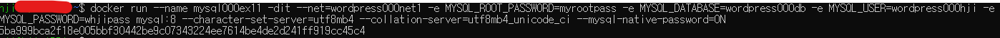
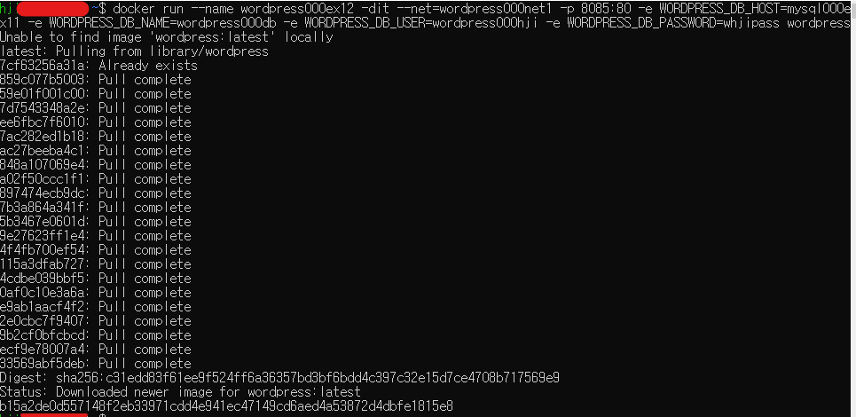
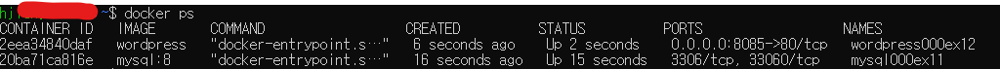
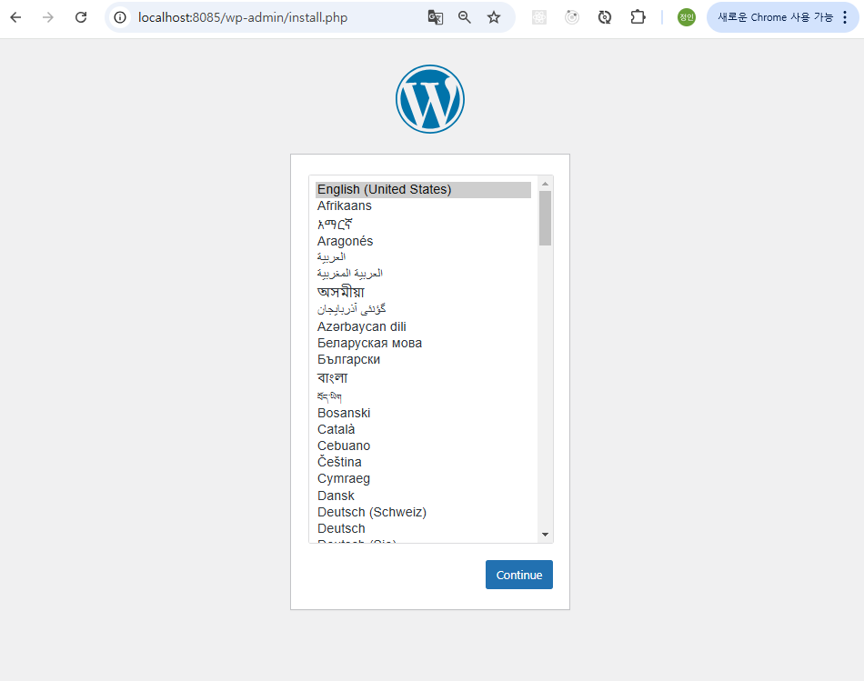

# 여러 개의 컨테이너를 연동해 실행해보자

## 워드프레스 구축
### 워드프레스 사이트 구성 및 구축
* 워드프레스 : 웹 사이트를 만들기 위한 sw
    * 워드프레스 공식 이미지 : 워드프레스 프로그램 본체+아파치+PHP 런타임
    * 설정 : 워드프레스 컨테이너 + MySQL 컨테이너

### 도커 네트워크 생성/삭제
* 워드프레스 컨테이너와 MySQL 컨테이너는 연결되어 있어야 한다.
    * => **가상 네트워크를 만들고 이 네트워크에 2개의 컨테이너를 소속시켜 연결한다**
* 도커 네트워크 생성 : ```docker network create 네트워크_이름```
* 도커 네트워크 삭제 : ```docker network rm 네트워크_이름```
* 도커 네트워크 목록 조회: ```docker network ls```
* 그 외 도커 네트워크 관련 커맨드
    |커맨드|내용|생략 가능 여부|주요 옵션|
    |----|----|----|----|
    |connect|네트워크에 컨테이너를 새로이 접속|X|거의 사용하지 않음|
    |disconnect|네트워크에서 컨테이너의 접속을 끊음|X|거의 사용하지 않음|
    |create|네트워크를 생성|X|거의 사용하지 않음|
    |inspect|네트워크의 상세 정보를 확인|X|거의 사용하지 않음|
    |ls|네트워크의 목록을 확인|X|거의 사용하지 않음|
    |prune|현재 아무 컨테이너도 접속하지 않은 네트워크를 모두 삭제|X|거의 사용하지 않음|
    |rm|지정한 네트워크를 삭제|X|거의 사용하지 않음|

### MySQL 컨테이너 실행 시에 필요한 옵션과 인자
* 자주 사용하는 커맨드 : ```docker run --name 컨테이너_이름 -dit --net=네트워크_이름 -e MYSQL_ROOT_PASSWORD=MySQL_루트_패스워드 -e MYSQL_DATABASE=데이터베이스_이름 -e MYSQL_USER=MySQL_사용자이름 -e MYSQL_PASSWORD=MySQL_패스워드 mysql --character-set-server=문자_인코딩 --collation-server=정렬_순서 --mysql-native-password=ON```
    * 사용된 옵션
        * --net : 컨테이너를 연결할 도커 네트워크
        * -e : 환경변수를 설정
    * 사용된 인자
        |항목|인자|값|의미|
        |---|---|---|---|
        |문장인코딩|--character-set-server=|utf8mb4|문자 인코딩으로 UTF8을 사용|
        |정렬 순서|--collation-server=|utf8mb4_unicode_ci|정렬 순서로 UTF8을 따름|
        |인증 방식|~~--default-authentication-plugin=~~|~~mysql_native_password~~|~~인증 방식을 예전 방식(native)으로 변경~~(적용이 안되어 아래 방법으로 진행)|
        |인증 방식|--mysql-native-password=|ON|인증 방식을 예전 방식(native)으로 변경|
        * 인증방식은 MySQL5에서 MySQL8로 넘어오면서 **외부 소프트웨어가 MySQL에 접속하는 인증 방식이 바뀌었다.**

### WordPress 컨테이너 실행 시에 필요한 옵션과 인자
* 자주 사용하는 커맨드 : ```docker run --name 컨테이너_이름 -dit --net=네트워크_이름 -p 포트_설정 -e WORDPRESS_DB_HOST=데이터베이스_컨테이너_이름 -e WORDPRESS_DB_NAME=데이터베이스_이름 -e WORDPRESS_DB_USER=데이터베이스_사용자_이름 -e WORDPRESS_DB_PASSWORD=데이터베이스_패스워드 wordpress```
    * 사용된 옵션
        * --net : 컨테이너를 연결할 도커 네트워크 이름
        * --name : 워드프레스 컨테이너 이름
        * -dit : 실행 옵션
        * -p : 포트 번호 설정
        * -e WORDPRESS_DB_HOST : 데이터베이스 컨테이너 이름
        * -e WORDPRESS_DB_NAME : 데이터베이스 이름
        * -e WORDPRESS_DB_USER : 데이터베이스 사용자 이름
        * -e WORDPRESS_DB_PASSWORD : 데이터베이스 패스워드
    * 워드프레스는 DB를 사용하는 sw이므로, 연동될 DB에 대한 정보를 설정한 것 (= mysql 컨테이너의 설정값과 동일한 값이여야 한다.)

<br/><br/>

## 워드프레스 및 MySQL 컨테이너 생성과 연동
### 실습
※ 주의점: 도커 네트워크를 생성할 것!, MySQL 컨테이너를 먼저 생성할 것!

1. 도커 네트워크 생성 : ```docker network create wordpress000net1```
    
2. MySQL 컨테이너 생성 및 실행 : ```docker run --name mysql000ex11 -dit --net=wordpress000net1 -e MYSQL_ROOT_PASSWORD=myrootpass -e MYSQL_DATABASE=wordpress000db -e MYSQL_USER=wordpress000hji -e MYSQL_PASSWORD=whjipass mysql:8 --character-set-server=utf8mb4 --collation-server=utf8mb4_unicode_ci --mysql-native-password=ON```
    
3. 워드프레스 컨테이너 생성 및 실행 : ```docker run --name wordpress000ex12 -dit --net=wordpress000net1 -p 8085:80 -e WORDPRESS_DB_HOST=mysql000ex11 -e WORDPRESS_DB_NAME=wordpress000db -e WORDPRESS_DB_USER=wordpress000hji -e WORDPRESS_DB_PASSWORD=whjipass wordpress```
    

4. 컨테이너 상태 확인 : ```docker ps```
    * STATUS이 UP이면 실행중인 것
    

5. 웹 브라우저를 통해 워드프레스에 접근해 확인 : http://localhost:8085
    

6. 뒷정리(컨테이너, 이미지, 네트워크 모두 삭제)
    * ```docker stop wordpress000ex12 mysql000ex11```
    * ```docker rm wordpress000ex12 mysql000ex11```
    * ```docker image rm wordpress mysql:8```
    * ```docker network rm wordpress000net1```

<br/><br/>

## 명령어를 직접 작성하자
### 소프트웨어와 데이터베이스의 관계 
* 기본 조합 : **리눅스 + 웹서버 + 프로그래밍 언어 런타임 + 데이터베이스**
* LAMP 스택 : 아파치 + PHP + MySQL 조합