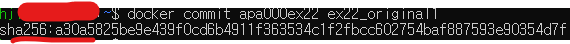

# 실전에 활용 가능한 컨테이너 사용법을 익히자

## 내게 필요한 지식이 무엇인지 정리하기
### 자신의 역할에 따라 알아야 할 지식이 달라진다.
* 서버 엔지니어나 보안 엔지니어라면 도커를 깊이 공부해야 한다.

### 앞으로 설명할 도커 기술
* 컨테이너와 호스트 사이에 파일 복사 : 컨테이너 -> 호스트, 호스트 -> 컨테이너로 파일을 복사
* 볼륨 마운트 : 바인드 마운트(컨테이너와 파일을 연동하는 데 많이 사용됨), 볼륨 마운트
* 컨테이너를 이미지로 만들기
* 컨테이너 개조
* 도커 허브 로그인 : 자신의 컨테이너를 공개하기 위한 서비스
* 도커 컴포즈 : 데이터베이스와 애플리케이션 컨테이너를 함께 시작하고 싶다거나, 환경을 대량으로 생성해야 할 때 유용함.
* 쿠버네티스 : 여러 대의 서버에서 컨테이너를 실행할 때 사용하는 '컨테이너 오케스트레이션 도구'

<br/><br/>

## 컨테이너와 호스트 간에 파일 복사하기
### 파일 복사 
* 파일 복사는 컨테이너 -> 호스트, 호스트 -> 컨테이너로 양방향 모두 가능하다.
* ```docker cp 원본_경로 복사할_경로```
    * 호스트 -> 컨테이너 : ```docker cp 호스트_경로 컨테이너_이름:컨테이너_경로```
    * 컨테이너 -> 호스트 : ```docker cp 컨테이너_이름:컨테이너_경로 호스트_경로```

* 호스트 경로의 예
* 파일의 위치는 '경로' 형태 일 것 : 컴퓨터 속 파일이나 폴더의 주소
    * 윈도우 : C:\Users\사용자명\Documents\파일명
    * macOS : /Users/사용자명/Documents/파일명
    * 리눅스 : /home/사용자명/파일명

### [실습] 호스트의 파일을 컨테이너 속으로 복사
0. 아파치 컨테이너 생성 : ```docker run --name apa000ex19 -d -p 8089:80 httpd```
    
1. 웹 브라우저를 통해 초기 화면 확인 : http://localhost:8089
    
2. 호스트->컨테이너로 파일 복사 : ```docker cp  C:\Users\hji\Documents\index.html apa000ex19:/usr/local/apache2/htdocs/```
    
    
    

3. 컨테이너-> 호스트로 파일 복사 : ```docker cp apa000ex19:/usr/local/apache2/htdocs/index.html /home/hji/index.html```
    
    

<br/><br/>

## 볼륨 마운트
### 볼륨과 마운트
* 볼륨 : 스토리지의 한 영역을 분할 한 것
    * 하드디스크나 SSD를 분할한 하나의 영역
* 마운트 : 연결하다 = 대상을 연결해 운영체제 또는 소프트웨어의 관리하에 두는 일
    * ex. USB를 컴퓨터에 꽂으면 띠딩한 뒤 폴더가 열리는 것
* 실제로 컨테이너를 사용하려면 스토리지 영역을 마운트해야 함.
    * 컨테이너는 성격상 '쓰고 버려야' 하기 때문에 언젠가는 삭제된다.
    * 그러므로 컨테이너 속에 데이터가 있다면 컨테이너와 함께 데이터도 소멸된다.
    * 그래서 처음부터 컨테이너 외부에 둔 데이터에 접근해 사용하는 것이 일반적이다. == **<u>데이터 퍼시스턴시</u>**

### 스토리지 마운트의 종류
* 볼륨 마운트 : 도커 엔진이 관리하는 영역 내에 만들어진 볼륨을 컨테이너에 디스크 형태로 마운트한다.
    * 이름만으로 관리가 가능하므로 다루기 쉽지만 볼륨에 비해 직접 조작하기 어려우므로 '임시 목적의 사용'이나 '자주 쓰지는 않지만 지우면 안 되는 파일'을 두는 목적으로 많이 사용함.
    * 도커 엔진의 관리 하에 있으므로 사용자가 파일 위치를 신경 쓸 필요가 없다.
    * 환경에 따라 경로가 바뀌는 일이 없다
    * 장점 : 익숙해지면 손쉽게 사용할 수 있다. (권장)
    * 단점 : 도커 컨테이너를 경유하지 않고 직접 볼륨에 접근할 방법이 없다. 억지로 볼륨을 수정하려고 하면 볼륨 자체가 깨질 우려도 있다. 백업을 하려고 해도 복잡한 절차가 필요하다.  
    

* 바인드 마운트 : 도커 엔진에서 관리하지 않는 영역의 기존 디렉토리(도커가 설치된 컴퓨터의 문서 폴더, 바탕화면 폴더)를 컨테이너에 마운트 하는 방식
    * 폴더가 아닌 파일 단위로도 마운트가 가능함.
    * 폴더 속에 파일을 직접 두거나 열어볼 수 있기 때문에 자주 사용하는 파일을 두는 데 사용한다.
    * 장점 : 도커가 관리하지 않는 영역이라도 파일을 둘 수 있으며, 
    **기존과 동일한 방식으로 파일을 사용**할 수 있으므로 다른 sw를 사용해 쉽게 편집할 수 있다. 도커 엔진과 무관하게 파일을 다룰 수 있다. (ex. 워드프레스처럼 파일을 자주 편집해야 하는 경우에는 바인드 마운트를 사용해야 함.)
    

* 두 가지 마운트 방식의 차이점
    1. **간단한지 복잡한지**
    2. **호스트 컴퓨터에서 파일을 다룰 필요가 있는지**
    3. **환경의 의존성을 배제해야 하는지**
    * 결론 : 파일을 직접 편집해야 할 일이 많다면 바인드 마운트, 그렇지 않다면 볼륨 마운트를 사용하기

    |항목|볼륨 마운트|바인드 마운트|
    |----|---------|-----------|
    |스토리지 영역|볼륨|디렉터리 또는 파일|
    |물리적 위치|도커 엔진의 관리 영역|어디든지 가능|
    |마운트 절차|볼륨을 생성한 후 마운트|기존 파일 또는 폴더를 마운트|
    |내용 편집|도커 컨테이너를 통해서|일반적인 파일과 같이|
    |백업|절차가 복잡함|일반적인 파일과 같이|

    ※ 단, 볼륨 마운트의 볼륨은 미리 만들어두는 것이 좋음

### 스토리지 영역을 마운트하는 커맨드
* 스토리지 마운트(둘 다)는 run 커맨드의 옵션 형태로 지정한다.
    * = 마운트하려는 스토리지의 경로가 컨테이너 속 특정 경로와 연결되도록 설정하는 형태
    * = 바탕화면에 있는 소프트웨어의 단축 아이콘(실제 실행되는 프로그램은 바탕화면이 아닌 다른 곳에 있지만 단축 아이콘을 사용해 마치 바탕화면에 프로그램이 있는 것처럼 사용할 수 있음.)
    * = 마운트되는 스토리지는 본래 별도의 장소에 있지만 마치 컨테이너 안에 있는 것처럼 설정하는 것
    * 실체는 B에 있지만 A에 있는 것처럼 설정한다.
    

* 스토리지를 마운트하는 절차
    1. 스토리지 영역을 생성 : 볼륨 마운트의 경우 마운트 전에 별도로 볼륨을 먼저 생성하는 것이 좋다.
    2. 컨테이너를 생성(및 마운트)

* 스토리지 영역을 만드는 방법
    * 바인드 마운트
        1. 원본이 될 폴더나 파일을 먼저 만들기
    * 볼륨 마운트
        1. 볼륨 생성 : ```docker volumne create 볼륨_이름```    
        2. 볼륨 삭제 : ```docker volumne rm 볼륨_이름```
    * 주요 하위 커맨드
        |커맨드|내용|생략형|주요 옵션|
        |----|---|---|---|
        |create|볼륨을 생성|X|거의 사용하지 않음|
        |inspect|볼륨의 상세 정보를 출력|X|거의 사용하지 않음|
        |ls|볼륨의 목록을 출력|X|거의 사용하지 않음|
        |prune|현재 마운트되지 않은 볼륨을 모두 삭제|X|거의 사용하지 않음|
        |rm|지정한 볼륨을 삭제|X|거의 사용하지 않음|

* 스토리지를 마운트하는 커맨드
    * -v 옵션 뒤에 '스토리지 실제 경로' 또는 '볼륨 이름', '컨테이너 마운트 경로' 순서대로 기재한다. 경로는 콜론(:)을 사용해 구분한다.
    * 바인드 마운트 : ```docker run (생략) -v 스토리지_실제_경로:컨테이너_마운트_경로```
    * 볼륨 마운트 : ```docker run (생략) -v 볼륨_이름:컨테이너_마운트_경로```

### [실습] 바인드 마운트해보기
* 아파치 컨테이너를 소재로 '일반 폴더 생성 후' -> '컨테이너를 생성할 때 옵션으로 이 폴더를 마운트하기' -> '폴더 속의 파일을 수정함으로써 마운트가 잘 됐는지 확인'

1. 마운트 원본이 될 폴더 만들기 : ```mkdir apa_folder```
    
2. run 커맨드로 아파치 컨테이너 실행 : ```docker run --name apa000ex20 -d -p 8090:80 -v /home/hji/apa_folder:/usr/local/apache2/htdocs httpd```
    
3. 웹 브라우저를 통해 아파치에 접근해 초기 화면 확인 : http://localhost:8090/
    
4. 마운트된 폴더에 index.html 파일을 배치
    
5. index.html 파일이 변경됐는지 확인
    
6. 컨테이너 종료 후 삭제

### [실습] 볼륨 마운트해보기
* 볼륨 생성 : ```docker volume create apa000vol1```
* 볼륨 상세 정보 확인 : ```docker volume inspect apa000vol1``` 
* 볼륨 삭제 : ```docker volume rm apa000vol1``` 
* -v 옵션 : -v apa000vol1:/usr/local/apache2/htdocs

1. 마운트할 볼륨 생성 : ```docker volume create apa000vol1```
    

2. run 커맨드로 아파치 컨테이너 실행 : ```docker run --name apa000ex21 -d -p 8091:80 -v apa000vol1:/usr/local/apache2/htdocs httpd```
    

3. 볼륨의 상세 정보 확인 : ```docker volume inspect apa000vol1```
    
    * 컨테이너 상세 정보 : ```docker container inspect apa000ex21```
        

<br/><br/>

## 컨테이너로 이미지 만들기
### 컨테이너로 이미지 만드는 방법
* 방법 1 : commit 커맨드로 컨테이너를 이미지로 변환
    * ```docker commit 컨테이너_이름 새로운_이미지_이름```
* 방법 2 : Dockerfile 스크립트로 이미지 만들기
    * Dockerfile은 사실 이미지를 만드는 것밖에 할 수 없다. (**도커 이미지 파일** 정도의 존재)
    * Dockerfile 스크립트에는 토대가 될 이미지나 실행할 명령어 등을 기재한다.
    * ```docker build -t 생성할_이미지_이름 재료_폴더_경로```
    * 스크립트 ex : 
        ```docker
        FROM 이미지_이름
        COPY 원본_경로 대상_경로
        RUN 리눅스_명령어
        ...
        ```
    * 주요 Dockerfile 인스트럭션
        * FROM : 토대가 되는 이미지를 지정
        * ADD : 이미지에 파일이나 폴더를 추가
        * COPY : 호스트에서 컨테이너로 파일 및 디렉토리를 복사
        * RUN : 이미지를 빌드할 때 컨테이너에서 실행할 명령어를 지정
        * CMD : 컨테이너를 실행할 때 실행할 명령어를 지정
        * ENTRYPOINT : 컨테이너를 실행할 때 실행할 명령을 강제 지정
        * ONBUILD : 이 이미지를 기반으로 다른 이미지를 빌드할 때 실행할 명령어를 지정
        * EXPOSE : 이미지가 통신에 사용할 포트를 명시적으로 지정
        * VOLUME : 퍼시스턴시 데이터를 저장할 경로를 명시적으로 지정
        * ENV : 환경변수를 정의
        * WORKDIR : RUN,CMD,ENTRYPOINT,ADD,COPY에 정의된 명령어를 실행하는 작업 디렉터리를 지정
        * SHELL : 빌드 시 사용할 셸을 변경
        * LABEL : 이름이나 버전, 저작자 정보를 설정
        * ARG : docker build 커맨드를 사용할 때 입력받을 수 있는 인자를 선언
        * STOPSIGNAL : docker stop 커맨드를 사용할 때 컨테이너 안에서 실행 중인 프로그램에 전달되는 시그널을 변경
        * HEALTHCHECK : 컨테이너 헬스체크 방법을 커스터 마이징

### [실습] commit 커맨드로 컨테이너를 이미지로 변환
0. 아파치 컨테이너 준비 : ```docker run --name apa000ex22 -d -p 8092:80 httpd```
    
1. 컨테이너를 변환한 새로운 이미지 생성 : ```docker commit apa000ex22 ex22_original1```
    
    
2. 이미지가 생성됐는지 확인 : ```docker image ls```
    
    

### [실습] Dockerfile 스크립트로 이미지 만들기
1. 재료 폴더에 재료 준비
    * apa_folder 준비
    * apa_folder 안에 index.html 파일 배치
    
2. Dockerfile 스크립트 작성
    * apa_folder 안에 저장하기
    * 파일명 : Dockerfile
        ```docker
        FROM httpd
        COPY index.html /usr/local/apache2/htdocs
        ```
    
3. build 커맨드로 이미지 빌드 : ```docker build -t ex22_original2 /home/hji/apa_folder```
    
4. 이미지가 생성되었는지 확인 : ```docker image ls```
    
    
5. 뒷정리 : 삭제

<br><br>

## 컨테이너 개조
### 컨테이너 개조란?
* 컨테이를 개조하는 방법
    * 방법 1 : 파일 복사와 마운트를 이용한 방법
    * 방법 2 : 컨테이너에서 리눅스 명령어를 실행하는 방법. sw를 설치하거나 설정을 변경할 수 있음.
        * 컨테이너에서 명령어를 실행하려면 셸이 필요하다.
        > * shell : 리눅스에 우리의 명령을 전달해 주는 프로그램(ex. bash)
        > * bash를 실행하는 방법 : ```/bin/bash```
        > * bash에서 나오기 : ```exit```
        * 컨테이너 속에서 명령어를 실행하는 커맨드 : ```docker exec (옵션) 컨테이너_이름 /bin/bash```
            * ex : ```docker exec -it apa000ex23 /bin/bash```
        * bash를 사용한 컨테이너 조작이 끝나고 나면 다시 docker start 커맨드로 컨테이너를 재시작해야 한다.
        * bash를 통해 컨테이너 내부를 조작하는 동안에는 도커 명령을 사용할 수 없다.
        * 요약 : 컨테이너를 만들고 삭제하거나 컨테이너 자체에 대한 명령은 도커 엔진을 통하며, 컨테이너 내부를 다루는 명령은 bash를 통한다. => 즉, <u>컨테이너 안에서 할 일을 마쳤다면 다시 컨테이너에서 나와야 한다</u>

### 도커의 구조, 도커 엔진을 통해야 하는 명령과 컨테이너 안에서 실행해야 하는 명령
* 도커 엔진을 통한 명령
    * 도커 엔진 자체의 시작 또는 종료
    * 네크워크, 디스크 설정
    * 실행 중인 컨테이너 목록 확인, 생성,종료, 이미지 내려받기 등 **컨테이너 전체에 대한 관리** 작업
    * ```docker``` 명령어를 사용하는 것

* 컨테이너 내부에서 실행하는 명령
    * 컨테이너 속에 새로운 소프트웨어를 추가
    * 컨테이너 속 소프트웨어의 실행 및 종료, 설정 변경
    * 컨테이너 안과 밖의 파일 복사 및 이동, 삭제 작업

* 도커와 컨테이너는 별개의 언어를 사용한다
    * 부모자식과도 같은 관계를 띄지만 별개의 존재이므로 언어가 다를 수 있다. 
    * 컨테이너에 들어있는 '운영체제 비슷한 것'의 종류가 무엇이냐에 따라 컨테이너 내부에서 사용하는 명령어가 약간씩 달라지게 된다.
* 특별한 이유가 없다면 데비안 계열을 기반으로 하는 것이 좋다
> * 데비안 계열에서 아파치를 설치하는 명령 : apt install apache2
> * 레드햇 계열에서 아파치를 설치하는 명령 : yum install httpd

<br><br>

## 도커 허브 등록 및 로그인
### 이미지는 어디서 내려받는 걸까?
* docker run 을 통해 자동으로 다운된 이미지는 도커 허브에 저장된 것이다.
* 직접 만든 이미지도 도커 허브에 올릴 수 있으며, 비공개로 사용하는 도커 허브 같은 장소도 만들 수 있다.

### 도커 허브와 도커 레지스트리
* 도커 레지스트리 : 이미지를 배포하는 장소
    * 일반, 공개, 비공개 상관없이 이미지가 배포되는 곳은 모두 도커 레지스트리다.
* 도커 허브 : 도커 제작사에서 운영하는 공식 도커 레지스트리
    * 아파치, MySQL, 우분투의 공식 이미지 모두 도커 허브에 참여해 도커 허브에서 이미지를 배포한다.


* 레지스트리(등록 장부) : 이미지를 배포하는 장소
* 리포지토리(창고) : 레지스트리를 구성하는 단위
* ex. zoozoo라는 회사에서 '냥파치'와 '멍SQL'을 만들 경우, 레지스트리는 회사나 부서 단위로 만들지만 리포지토리는 소프트웨어를 단위로 한다.
    
* 도커 허브는 각각의 회사나 개인이 가진 레지스트리가 여럿 모인 형태가 된다.
    

### 태그와 이미지 업로드
* 도커의 태그 : 레지스트리에 업로드를 상정한 이미지 이름
    * ```zoozoo.coomm/nyapacchi:13```형식 : ```레지스트리 주소/리포지토리이름:버전```
    * 비공개 레지스트리의 태그 명명 예 : ```레지스트리 주소/리포지토리이름:버전```
        * ```localhost:5000/aaa:13``` : 자신의 PC에 만든 레지스트리, 리포지토리 이름은 aaa, ver13
        * ```zoozoo.comm/aaa:13``` : 레지스트리 도메인 은 zoozoo.comm, 리포지토리 이름은 aaa, ver13
    * 도커 허브의 태그 명명 예 : ```도커_허브_ID/리포지토리_이름:버전```
        * ```zoozoosagi/aaa:13``` : 도커 허브 ID는 zoozoosagi, 리포지토리 이름은 aaa, ver13

* 이미지에 태그를 부여해 복제하는 커맨드
    * 원래 있던 이미지 이름을 태그로 바꾸고 이미지르 복제하라는 의미
    * ```docker tag 원래_이미지_이름 레지스트리_주소/리포지토리_이름:버전```
    * ex. ```docker tag apa000ex22 zoozoo.comm/aaa:13``` : 원래 이미지 이름이 apa000ex22인 이미지에 레지스트리 주소는 zoozoo.comm, 리포지토리 이름은 aaa, 버전은 13으로 태그를 부여
* 이미지를 업로드하는 커맨드
    * **docker push 커맨드는 이미지를 업로드 하는 커맨드**
    * ```docker push 레지스트리_주소/리포지토리_이름_버전(=태그)``` : 태그에 포함된 레지스트리 주소의 도메인에 있는 레지스트리로 업로드를 시도함. 리포지토리는 처음 업로드할 때는 존재하지 않음.(push를 실행하며 만들어진다.)
    * ex. ```docker push zoozoo.comm/aaa:13``` : zoozoo.comm/aaa:13을 업로드한다.

### 레지스트리를 만드는 방법
* 개발 회사는 대개 사내용 도커 레지스트리를 만들고 여기에 개발환경 이미지를 올려 배포하는 체계를 갖추고 있다. 외부 공개를 목적으로 한다면 도커 허브가 가장 이상적이다.
* 비공개 레지스트리를 만드는 방법
    * 레지스트리도 도커를 통해 운영할 수 있으며, 레지스트리용 컨테이너가 따로 있으므로 이를 사용하면 된다.
    * 컨테이너를 만들면 사용자는 레지스트리에 로그인한 다음 이미지를 내려받을 곳으로 이 레지스트리를 지정한다.
    * 레지스트리는 포트 5000번을 사용한다.
    * 이미지를 올리거나 내려받을 때 이 레지스트리를 지정하면 되고, 로컬 레지스트리의 경우 레지스트리 컨테이너가 삭제되면 모든 데이터가 삭제되기 때문에 주의해야 한다.
    * ```docker run -d -p 5000:5000 registry```
    * ex. 로컬 registry에 이미지 업로드 하기
        1. 이미지 만들기 : ```docker build -t img_test /home/hji/apa_folder```
            * ```docker image ls```
        2. 1번 이미지에 tag 부여해서 복제 : ```docker tag img_test localhost:5000/img_test:1.0```
            * ```docker image ls```
        3. push로 로컬 레지스트리에 업로드 하기 : ```docker push localhost:5000/img_test:1.0```
        4. 로컬 registry에서 이미지 내려받기 : ```docker image pull localhost:5000/img_test:1.0```
        * registry 안의 리포지토리에 있는 이미지 목록 출력하기 : ```docker image ls localhost:5000/img_test```

* 도커 허브 사용
    * 이메일 주소만 있으면 누구든지 도커 허브에 가입할 수 있다.
    * 도커 허브에 이미지를 업로드하면 전 세계 사람들에게 이미지를 배포할 수 있고, 비공개 설정을 할 수도 있다.
    * https://hub.docker.com
    * ex. 도커 허브에 (비)공개 레지스트리 구축 및 이미지 업로드
        1. 도커 허브에 repository 생성
        2. 터미널에서 도커 허브에 로그인 하기 : ```docker login```
        3. 이미지 생성 : ```docker build -t img_dockerhub /home/hji/apa_folder```
        4. 태그 부여 : ```docker image tag img_dockerhub hji/private_repo:1.0```
            * docker images
        5. 올리기 : ```docker push hji/private_repo:1.0```
            * 도커 허브의 ```hji```이라는 registry의 **private_repo**라는 repository에 1.0이라는 태그를 가진 이미지가 업로드 된다. 

##### 레지스트리 업로드 실습 출처 : https://yudaeng-log.tistory.com/91#1)%20%EB%A1%9C%EC%BB%AC%20%EB%B9%84%EA%B3%B5%EA%B0%9C%20%EB%A0%88%EC%A7%80%EC%8A%A4%ED%8A%B8%EB%A6%AC-1