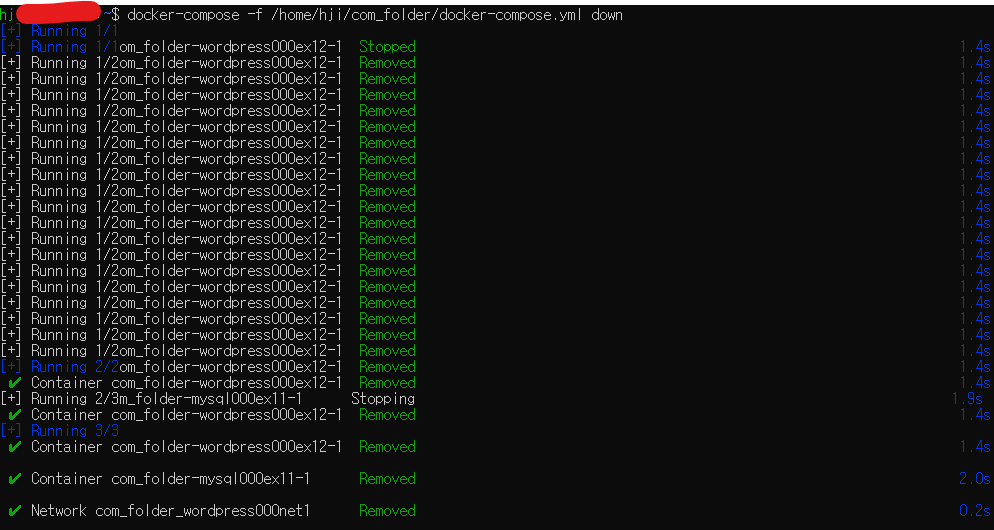

# 도커 컴포즈

## 도커 컴포즈란?
### 도커 컴포즈란?
* 도커 컴포즈 : **시스템 구축과 관련된 명령어를 하나의 텍스트 파일(정의 파일)에 기재해 명령어 한번에 시스템 전체를 실행하고 종료와 폐기까지 한번에 하도록 도와주는 도구**
    * 도커 컴포즈를 사용하면 여러 개의 명령어를 하나의 정의 파일로 합쳐 실행할 수 있다.
    * 시스템 구축에 필요한 설정을 YAML(YAML Ain't a Markup Language)포맷으로 기재한 정의 파일을 이용해 전체 시스템을 일괄 실행 또는 일괄 종료 및 삭제할 수 있는 도구
    * 구조 : 컨테이너나 볼륨을 **어떠한 설정으로 만들지**에 대한 항목이 기재되어 있다.
    * ```up 커맨드``` : docker run과 비슷하며, 이미지를 내려받고 컨테이너를 생성 및 실행한다.
    * ```down 커맨드``` : 컨테이너와 네트워크를 정지 및 삭제한다. 볼륨과 이미지는 삭제하지 않는다.
    * ```stop 커맨드``` : 컨테이너와 네트워크 삭제 없이 종료만 하고 싶을 경우

* 도커 컴포즈와 Dockerfile 스크립트의 차이점
    * 도커 컴포즈 : docker run 명령어를 여러 개 모아놓은 것. **컨테이너와 주변 환경을 생성하며, 네트워크와 볼륨까지 함께 만들 수 있다.**
    * Dockerfile 스크립트 : 이미지를 만들기 위한 것. **네트워크나 볼륨은 만들 수 없다.**
    * => 즉, 만드는 대상이 다르다.

> * 도커 컴포즈와 쿠버네티스의 차이점 : 쿠버네티스는 컨테이너를 관리하는 도구인 데 비해 도커 컴포즈의 기능은 컨테이너를 생성하고 삭제하는 것뿐으로, 컨테이너 관리 기능은 없다.

<br/><br/>

## 도커 컴포즈의 설치와 사용법
### [실습] 도커 컴포즈 설치
* 도커 컴포즈는 도커 엔진과 별개의 소프트웨어이며, 도커 컴포즈로 생성한 컨테이너를 도커 엔진으로 똑같이 관리할 수 있다.
    * 도커 데스크톱은 도커 컴포즈가 함께 설치됨.
    * 도커 컴포즈는 파이썬으로 작성된 프로그램이라서 파이썬 런타임이 필요함.
1. 도커 컴포즈 설치(리눅스)
    ```
    # 파이썬 3 및 도커 컴포즈 설치
    sudo apt install -y python3 python3-pip
    sudo pip3 install docker-compose

    # 설치 확인
    docker-compose -version
    ```
2. 도커 컴포즈 실행 : 도커 컴포즈는 설치가 끝나면 바로 실행 가능한 상태가 된다.

### 도커 컴포즈의 사용법
* 도커 컴포즈를 사용하려면 호스트 컴퓨터에 폴더를 만들고 이 폴더에 정의 파일(YAML파일)을 배치한다.

* 정의 파일의 이름은 <u>**docker-compose.yml**</u>이라는 이름을 사용해야 한다. 
    * 명령어는 도커 엔진에 전달되며, 만들어진 컨테이너도 동일하게 도커 엔진 위에서 동작한다.
    
        * 도커 컴포즈가 명령어를 대신 입력해주는 구조이다.
    * 정의 파일은 <u>**한 폴더에 1개만**</u> 있을 수 있다.
    * 컨테이너 생성에 필요한 이미지 파일이나 HTML 파일 역시 컴포즈가 사용할 폴더에 함께 둔다.

> * 서비스와 컨테이너
>   * 서비스 : 도커 컴포즈에서 컨테이너가 모인 것

<br/><br/>

## 도커 컴포즈 파일을 작성하는 법
### 도커 컴포즈 정의 파일의 내용 살펴보기
* 도커 컴포즈는 정의 파일(컴포즈 파일)을 그대로 실행하는 역할을 하므로 컴포즈 파일이 반드시 필요하다.
* ex. 4장 아파치 컨테이너(apa000ex2)와 같은 컨테이너를 만드는 컴포즈 파일 : ```docker run --name apa000ex2 -d -p 8080:80 httpd```
    ```yml
    # docker-compose.yml
    version: "3"

    services:
        apap000ex2:
            image: httpd
            ports:
                - 8080:80
            restart: always
    ```
* ex. 5장 아파치 컨테이너(apa000ex2)와 같은 컨테이너를 만드는 컴포즈 파일 : ```docker run --name wordpress000ex12 -dit --net=wordpress000net1 -p 8085:80 -e WORDPRESS_DB_HOST=mysql000ex11 -e WORDPRESS_DB_NAME=wordpress000db -e WORDPRESS_DB_USER=wordpress000hji -e WORDPRESS_DB_PASSWORD=whjipass wordpress```
    ```yml
    # docker-compose.yml
    version: "3"

    services:
        wordpress000ex12:
            depend_onL:
                - mysql000ex11
            image: wordpress
            networks:
                - wordpress000net1
            ports:
                - 8085:80
            restart: always
            environment:
                WORDPRESS_DB_HOST=mysql000ex11
                WORDPRESS_DB_NAME=wordpress000db
                WORDPRESS_DB_USER=wordpress000hji
                WORDPRESS_DB_PASSWORD=whjipass
    ```

### 컴포즈 파일(정의 파일)을 작성하는 방법
* 정해진 규격
    * 정의 파일 형식 : YAML 형식
    * (정해진)파일 이름 : docker-compose.yml
* 컴포즈 파일을 작성하는 방법
    * 컴포즈 파일을 맨 앞에 컴포즈 버전을 적고, 그 뒤로 services와 networks, volumes를 차례로 기재함.
    * services는 컨테이너에 대한 내용
    * 도커 컴포즈와 쿠버네티스에서는 컨테이너의 집합체를 서비스라고 부름.
    * 작성 요령 : 주 항목 -> 이름 추가 -> 설정
        * 주 항목 : version, services, networks, volumes
            ```yml
            verions: "3"
            services:
            networks:
            volumes:
            ```
        * 이름 기재 : 같은 개수의 공백을 한 단으로 사용(들여쓰기)
            ```yml
            verions: "3"
            services:
                컨테이너_이름1: 
                컨테이너_이름2: 
            networks:
                네트워크_이름1: 
            volumes:
                볼륨_이름1: 
                볼륨_이름2: 
            ``` 
        * 설정
            ```yml
            verions: "3"
            services:
                컨테이너_이름1: 
                    image: 이미지_이름
                    networks:
                        - 네트워크_이름
                    ports:
                        - 포트_설정
                컨테이너_이름2: 
                    image: 이미지_이름
            networks:
                네트워크_이름1: 
            volumes:
                볼륨_이름1: 
                볼륨_이름2:             
            ```

* 컴포즈 작성 요령 정리
    1. 첫 줄에 도커 컴포즈 버전을 기재
    2. 주 항목 services, networks, volumes 아래에 설정 내용을 기재
    3. 항목 간의 상하 관계는 공백을 사용한 들여쓰기로 나타낸다.
    4. 들여쓰기는 같은 수의 배수만큼의 공백을 사용한다.
    5. 이름은 주 항목 아래에 들여쓰기한 다음 기재한다.
    6. 컨테이너 설정 내용은 이름 아래에 들여쓰기한 다음 기재한다.
    7. 여러 항목을 기재하려면 줄 앞에 '-'를 붙인다.
    8. 이름 뒤에는 콜론(:)을 붙인다.
    9. 콜론 뒤에는 반드시 공백이 와야 한다(바로 줄바꿈하는 경우는 예외)
    10. '#' 뒤에 내용은 주석으로 간주된다.
    11. 문자열은 작은따옴표(') 또는 큰따옴표(")로 감싸 작성한다.

* 컴포즈 파일의 항목 
    * 주 항목
        |항목|내용|
        |---|---|
        |services|컨테이너를 정의|
        |networks|네트워크를 정의|
        |volumes|볼륨을 정의|
    * 정의 내용
        |항목|docker run 커맨드의 해당 옵션 또는 인자|내용|
        |---|---|---|
        |image|이미지 인자|사용할 이미지를 지정|
        |networks|--net|접속할 네트워크를 지정|
        |volumes|-v, --mount|스토리지 마운트를 지정|
        |ports|-p|포트 설정|
        |environment|-e|환경 변수 설정|
        |depends_on|없음|다른 서비스에 대한 의존관계를 정의(ex. ```depends_on: -namgeuk```이라면 namgeuk 컨테이너를 생성한 다음에 해당 컨테이너를 만든다.)|
        |restart|없음|컨테이너 종료 시 재시작 여부를 설정|
    * 컨테이너 종료 시 재시작 여부

        |설정값|내용|
        |------|---|
        |no|재시작하지 않는다.|
        |always|항상 재시작한다.|
        |on-failure|프로세스가 0 외의 상태로 종료됐다면 재시작한다.|
        |unless-stopped|종료 시 재시작하지 않음. 그 외에는 재시작한다.|

* 그 외 정의 항목
    |항목|docker run 커맨드의 해당 옵션 또는 인자|내용|
    |---|---|---|
    |command|커맨드 인자|컨테이너 시작 시 기존 커맨드를 오버라이드|
    |container_name|--name|실행할 컨테이너의 이름을 명시적으로 지정|
    |dns|--dns|DNS 서버를 명시적으로 지정|
    |env_file|없음|환경설정 정보를 기재한 파일을 로드|
    |entrypoint|--entrypoint|컨테이너 시작 시 ENTRYPOINT 설정을 오버라이드|
    |external_links|--link|외부 링크를 설정| 
    |extra_hosts|--add-host|외부 호스트의 IP 주소를 명시적으로 지정|
    |logging|--log-driver|로그 출력 대상을 설정|
    |network_mode|--network|네트워크 모드를 설정|

### [실습] 컴포즈 파일 작성
* MySQL을 먼저 만들어야 하므로 앞에 작성한다. 또한 워드프레스 컨테이너는 depends_on 항목을 추가해 의존관계를 설정해야 한다.

0. 컴포즈 파일을 배치할 경로 : ```/home/hji/com_folder```
1. docker-compose.yml 파일 생성
    
2. 주 항목 작성
    ```yml
    version: "3"
    services:
    networks:
    volumes:
    ```
3. 이름 작성
    ```yml
    version: "3"
    services:
        mysql000ex11:
        wordpress000ex12:
    networks:
        wordpress000net1:
    volumes:    
        mysql000vol11:
        wordpress000vol12:
    ```
4. MySQL 컨테이너의 정의 작성
    ```yml
    version: "3"
    services:
        mysql000ex11:
            image: mysql:5.7
            networks:
                - wordpress000net1
            volumes:
                - mysql000vol11:/var/lib/mysql
            restart: always
            environment:
                MYSQL_ROOT_PASSWORD: myrootpass
                MYSQL_DATABASE: wordpress000db
                MYSQL_USER: wordpress000hji
                MYSQL_PASSWORD: hjipass
        wordpress000ex12:
    networks:
        wordpress000net1:
    volumes:    
        mysql000vol11:
        wordpress000vol12:
    ```    
5. 워드프레스 컨테이너 정의 작성
    ```yml
    version: "3"
    services:
        mysql000ex11:
            image: mysql:5.7
            networks:
                - wordpress000net1
            volumes:
                - mysql000vol11:/var/lib/mysql
            restart: always
            environment:
                MYSQL_ROOT_PASSWORD: myrootpass
                MYSQL_DATABASE: wordpress000db
                MYSQL_USER: wordpress000hji
                MYSQL_PASSWORD: hjipass
        wordpress000ex12:
            depends_on:
                - mysql000ex11
            image: wordpress
            networks:
                - wordpress000net1
            volumes:
                - wordpress000vol12:/var/www/html
            ports:
                - 8085:80
            restart: always
            environment:
                WORDPRESS_DB_HOST: mysql000ex11
                WORDPRESS_DB_NAME: wordpress000db
                WORDPRESS_DB_USER: wordpress000hji
                WORDPRESS_DB_PASSWORD: hjipass
    networks:
        wordpress000net1:
    volumes:    
        mysql000vol11:
        wordpress000vol12:
    ```   
6. 파일 저장

<br/><br/>

## 도커 컴포즈 실행
### 도커 컴포즈 커맨드 
* 도커 엔진을 통한 명령은 ```docker```, **도커 컴포즈는 ```docker-compose```명령**

1. ```docker-compose up``` : 컨테이너와 주변 환경을 생성
    * 컴포즈 파일에 정의된 내용을 따라 컨테이너와 볼륨, 네트워크를 생성하고 실행한다.
    * 컴포즈 파일 경로는 -f 옵션을 사용해 지정한다.
    * ```docker-compose -f 정의_파일_경로 up 옵션```
        * ex. ```docker-compose -f /home/hji/com_folder/docker-compose.yml up -d``` (-d : 컨테이너를 백그라운드로 실행)
    * 옵션 항목
        |옵션|내용|
        |---|---|
        |-d|백그라운드로 실행|
        |--no-color|화면 출력 내용을 흑백으로 함|
        |--no-deps|링크된 서비스를 실행하지 않음|
        |--force-recreate|설정 또는 이미지가 변경되지 않더라도 컨테이너를 재생성|
        |--no-create|컨테이너가 이미 존재할 경우 다시 생성하지 않음|
        |--no-build|이미지가 없어도 이미지를 빌드하지 않음|
        |--build|컨테이너를 실행하기 전에 이미지를 빌드|
        |--abort-on-container-exit|컨테이너가 하나라도 종료되면 모든 컨테이너를 종료|
        |-t, --timeout|컨테이너를 종료할 때의 타임아웃 설정, 기본은 10초|
        |--remove-orphans|컴포즈 파일에 정의되지 않은 서비스의 컨테이너를 삭제|
        |--scale|컨테이너의 수를 변경|

2. ```docker-compose down``` : 컨테이너와 네트워크를 삭제
    * 컴포즈 파일의 내용에 따라 컨테이너와 네트워크를 종료 및 삭제한다. 볼륨과 이미지는 삭제되지 않는다.
    * 컴포즈 파일의 경로는 -f 옵션으로 지정한다.
    * ```docker-compose -f 컴포즈_파일_경로 down 옵션```
    * 옵션 항목
        |옵션|내용|
        |---|---|
        |--rmi 종류|삭제 시에 이미지도 삭제한다.종류를 all로 지정하면 사용했던 모든 이미지가 삭제된다. local로 지정하면 커스텀 태그가 없는 이미지만 삭제한다.|
        |-v, --volumes|volumes 항목에 기재된 볼륨을 삭제한다. 단, external로 지정된 볼륨은 삭제되지 않는다|
        |--remove-orphans|컴포즈 파일에 정의되지 않은 서비스의 컨테이너도 삭제한다|

3. ```docker-compose stop``` : 컨테이너 종료
    * 컴포즈 내용에 따라 컨테이너 종료
    * 컴포즈 파일의 경로는 -f 옵션으로 지정한다.
    * ```docker-compose -f 컴포즈_파일_경로 stop 옵션```

* 그 밖의 주요 커맨드 목록
    |커맨드|내용|
    |----|----|
    |up|컨테이너를 생성하고 실행한다.|
    |down|컨테이너와 네트워크를 종료하고 삭제한다.|
    |ps|컨테이너 목록을 출력한다.|
    |config|컴포즈 파일을 확인하고 내용을 출력한다|
    |port|포트 설정 내용을 출력한다|
    |logs|컨테이너가 출력한 내용을 화면에 출력한다|
    |start|컨테이너를 시작한다|
    |stop|컨테이너를 종료한다.|
    |kill|컨테이너를 강제 종료한다.|
    |exec|명령어를 실행한다.|
    |run|컨테이너를 실행한다.|
    |create|컨테이너를 생성한다.|
    |restart|컨테이너를 재실행한다.|
    |pause|컨테이너를 일시 정지한다|
    |unpause|컨테이너의 일시 정지를 해제한다.|
    |rm|종료된 컨테이너를 삭제한다|
    |build|컨테이너에 사용되는 이미지를 빌드 혹은 재빌드한다|
    |pull|컨테이너에 사용되는 이미지를 내려받는다.|
    |scale|컨테이너의 수를 지정한다|
    |events|컨테이너로부터 실시간으로 이벤트를 수신한다.|
    |help|도움말 화면을 출력한다|

> * 현재 작업 폴더를 컴포즈용 폴더로 사용 : ```docker-compose up -d```

> * 도커 컴포즈로 실행한 컨테이너의 이름과 스케일링(scale 옵션)
>    * 도커 컴포즈로 실행한 컨테이너의 이름은 임의로 결정된다.
>       * ex. com_folder의 컴포즈 파일을 사용해 penguin이라는 이름의 컨테이너를 생성하면 => 실제 생성된 컨테이너 이름은 com_folder_penguin_1과 같이 폴더 이름과 번호가 붙음.(-f 옵션을 생략했다면 폴더 이름은 붙지 않음.)
> * 도커 컴포즈가 생성한 컨테이너의 실제 이름은 컴포즈 파일에 기재된 것과 다르다.
>   * 컴포즈 파일에 기재된 이름 : penguin, 도커 엔진으로 컨테이너를 관리할 때의 이름 : penguin_1
>   * 컴포즈 파일에 기재된 이름 : azarashi, 도커 엔진으로 컨테이너를 관리할 때의 이름 : azarashi_1
>   * 컴포즈 파일에 기재된 이름 : shachi, 도커 엔진으로 컨테이너를 관리할 때의 이름 : shachi_1
> * 같은 구성의 컨테이너를 여러 세트 만들고 싶다면 up 커맨드에 ```--scale```옵션 붙이기
>   * ```docker-compose -f /home/hji/com_folder/docker-coompose.yml up --scale penguin=3``` : 3개의 컨테이너가 실행됨

### [실습] 도커 컴포즈 실행
1. 컴포즈 파일 배치 : ```/home/hji/com_folder/docker-compose.yml```
2. 컴포즈 파일의 내용을 실행 : ```docker-compose -f /home/hji/com_folder/docker-compose.yml up -d```
    
    
    
3. 웹 브라우저에서 워드프레스에 접근 가능한지 확인 : http://localhost:8085/
    
4. 컨테이너와 네트워크를 종료 및 삭제 : ```docker-compose -f /home/hji/com_folder/docker-compose.yml down```
    
5. 뒷정리 : 이미지와 볼륨은 삭제되지 않기 때문에 직접 삭제하기