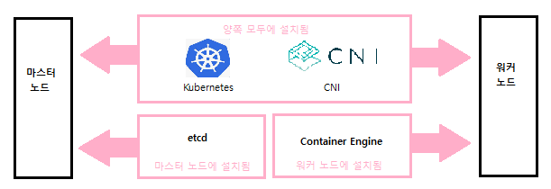

# 쿠버네티스를 익히자

## 쿠버네티스란?
### 쿠버네티스란?
* **쿠버네티스(k8s) : 컨테이너 오케스트레이션 도구**의 일종
    * 컨테이너 오케스트레이션 : 시스템 전체를 통괄하고 여러 개의 컨테이너를 관리하는 일
    * 오케스트라처럼 지휘자가 전체 악단을 지휘하듯, 여러 개의 컨테이너를 지휘하는 도구가 쿠버네티스 이다.
    * 쿠버네티스를 **k8s라고 줄여쓰기도 한다.** : k와 s사이에 8개의 글자가 있다는 의미의 약칭

* 쿠버네티스를 일반적인 프로그래머가 관리하는 일은 드물다.
    * why? 쿠버네티스는 <b>'여러 개의 컨테이너(=서버)'</b>를 관리하는 도구이기 때문이다. '여러 개'란 동일한 구성의 컨테이너의 여러 세트를 의미한다. => 즉, 많은 수의 서버로 구성되는 대규모 시스템을 관리할 일이 많은가? 라는 이야기 
    
    * **쿠버네티스로 어떤 일을 할 수 있는가**에 초점 맞추기

* 쿠버네티스는 여러 대의 컨테이너가 여러 대의 물리적 서버에 걸쳐 실행되는 것을 전제로 한다.
    * ex. 20개의 컴퓨터에 각각 1개씩 총 20개의 컨테이너를 만드려면 ```docker run``` 커맨드를 20번 실행해야 함으로 매우 지겹고 지루한 작업이다.
    * 도커 컴포즈를 사용한다 해도 물리적 서버가 여러 대라면 반복작업은 사라지지 않는다. + 물리적 서버를 일일이 모니터링하며 장애가 일어나면 컨테이너를 다시 실행해야 하는 것은 물론이고 컨테이너를 업데이트하려면 다시 한번 큰 수고가 따른다.
    * 쿠버네티스는 이렇게 **번거로운 컨테이너 생성이나 관리의 수고를 덜어주는 도구**다.
    * 도커 컴포즈에서 사용되는 컴포즈 파일과 비슷한 정의 파일(매니페스트 파일)만 작성하면 이 정의에 따라 모든 물리적 서버에 컨테이너를 생성하고, 생성한 컨테이너를 관리해준다.

<br/><br/>

## 마스터 노드와 워커 노드
### 클러스터의 구성 - 마스터 노드와 워커 노드
* 쿠버네티스 = 마스터 노드(전체적인 제어를 담당) + 워커 노드(실제 동작을 담당)
* 노드 : 거의 물리적 서버와 일치하는 개념
* 마스터 노드 : 감독과 같은 존재. **마스터 노드에서 컨테이너를 실행하지는 않으며** 워커 노드에서 실행되는 컨테이너를 관리하는 역할.
    * 도커 엔진같은 컨테이너 엔진도 설치되지 않음.
    * 컨테이너를 관리하느라 바쁨. 
* 워커 노드 : 실제 서버에 해당하는 부분. 컨테이너가 실제 동작하는 서버.
    * 컨테이너가 동작해야하므로 컨테이너 엔진이 설치되어야 한다.
* 클러스터 : 마스터 노드와 워커 노드로 구성된 일군의 쿠버네티스 시스템
    * 클러스터는 사람이 개입하지 않아도 마스터 노드에 설정된 내용에 따라 워커 노드가 관리되며 자율적으로 동작한다.
    * 관리자는 마스터 노드의 초기 설정 후 가끔 조정만 하면 되며, 관리자가 직접 워커 노드를 관리하는 일도 없다.


* 쿠버네티스를 사용하려면 먼저 설치가 필요하다.
    * 쿠버네티스는 **도커 엔진 등의 컨테이너 엔진과는 별개의 소프트웨어이다.**
    * 쿠버네티스 설치 시 필수 : 쿠버네티스 소프트웨어, CNI(Container Network Interface : 가상 네트워크 드라이버)(ex. 플란넬, 칼리코, AWS VPC CNI 등)
    * 마스터 노드 설치 시 필수 : 'etcd'라는 데이터베이스 (컨테이너 등의 상태를 관리하기 위해)
    * 워커 노드 설치 시 필수 : 도커 엔진 같은 컨테이너 엔진
    
    * 마스터 노드를 설정하는 관리자의 컴퓨터에는 kubectl을 설치한다. => kubectl을 설치해야 마스터 노드에 로그인해 초기 설정을 진행하거나 추후 조정이 가능하다. 

* 컨트롤 플레인(제어판)과 kube-let
    * 마스터 노드는 컨트롤 플레인을 통해 워커 노드를 관리한다.
    * 컨트롤 플레인은 5개의 컴포넌트(부품)으로 구성된다. (보통 etcd 외에 쿠버네티스에 포함되어 있으므로 굳이 추가로 설치할 필요 x)
        * 마스터 노드 측 컨트롤 플레인의 구성
            |항목|내용|
            |---|---|
            |kube-apiserver|외부와 통신하는 프로세스, kubectl로부터 명령을 전달받아 실행한다.|
            |kube-controller-manager|컨트롤러를 통합 관리, 실행한다|
            |kube-scheduler|파드를 워커 노드에 할당한다|
            |cloud-controller-manager|클라우드 서비스와 연동해 서비스를 생성한다.|
            |etcd|클러스터 관련 정보 전반을 관리하는 데이터베이스|
    * 워커 노드에서는 kube-let과 kube-proxy가 동작함.
        * kube-let : 마스터 노드의 kube-scheduler와 연동하며 워커 노드에 컨테이너 또는 볼륨을 배치하고 실행함.
        * 워커 노드의 구성
            |항목|내용|
            |---|---|
            |kube-let|마스터 노드에 있는 kube-scheduler와 연동하며 눠커 노드에 파드를 배치하고 실행한다. 또 실행중인 파드의 상태를 정기적으로 모니터링하며 kube-scheduler에 통지한다.|
            |kube-proxy|네트워크 통신의 라우팅 메커니즘|
    

### 쿠버네티스는 항상 '바람직한' 상태를 유지한다.
* 쿠버네티스도 컨테이너를 생성하거나 삭제할 수 있지만 일일이 명령어를 입력하는 방식을 사용하지는 않는다. 어떤 '바람직한 상태'("컨테이너는 00개, 볼륨은 XX개로 구성하라")를 YAML에 정의하고, 자동으로 컨테이너를 생성하거나 삭제하면서 이 상태를 만들고 유지하는 것이 쿠버네티스의 기본적인 아이디어이다.
* 도커 컴포즈는 옵션을 지정해 수동으로 컨테이너의 수를 바꿀 수는 있어도 모니터링 기능이 없어서 컨테이너를 만들 때 외에는 관여하지 않는다. But 쿠버네티스에는 '**이 상태를 유지**'하는 기능이 있다
    * 도커 컴포즈 -> 생성 후 끝
    * 쿠버네티스 -> 생성, 모니터링, 유지 
        * 컨테이너가 하나 망가지면 해당 컨테이너를 자동 삭제하고 새 컨테이너로 대체한다.
        * 바람직한 상태가 바뀌어도 삭제 또는 생성을 통해 정해진 상태를 유지한다.
        * ex. 바람직한 상태 : 컨테이너가 4개, 볼륨이 4개 일때 - 하나의 컨테이너가 망가졌다면 쿠버네티스가 알아서 망가진 컨테이너를 삭제하고 새 컨테이너로 대체하며, 정의에서 '컨테이너 4개'를 '컨테이너 3개'로 수정하면 컨테이너를 한 개 삭제한다.

* 쿠버네티스를 사용하는 시스템에서 컨테이너 삭제
    * 쿠버네티스의 기능 : 어디까지나 '자동으로 상태를 유지하는' 것으로, 컨테이너를 삭제하고 싶다면 파일에서 '바람직한 상태'를 수정해야 한다.(삭제 명령어를 입력하는 거 x)
    * 도커 명령어로 삭제할 수 있지만 **쿠버네티스의 목표는 '바람직한 상태를 유지하는 것'이므로 재생성한다. 그러므로 사람이 개입해서 컨테이너를 삭제해서는 안된다.**
        * 관리자가 직접 컨테이너를 삭제해도 쿠버네티스가 대체 컨테이너를 생성한다.
        * 따라서 컨테이너를 삭제하려면 반드시 '바람직한 상태'에 정의된 컨테이너 수를 줄이는 방법을 사용해야 한다(컨테이너를 모두 삭제하고 싶다면 필요한 컨테이너 수는 0이라고 지정하기)

* 결론 : **쿠버네티스는 정의된 '바람직한 상태'를 유지한다**

> * 로드 밸런서와 클라우드 컴퓨팅
>   * 로드 밸런싱 : 한 대의 서버에 모든 요청이 집중되지 않도록 여러 대의 서버를 갖추고 **요청을 각 서버에 분산하는 것**
>   * 로드 밸런서 : 각 서버에 나눠주는 역할
>   * 도커와 쿠버네티스 : 부하에 맞춰 컨테이너를 늘리거나 줄일 수 있게 한다. => 서버를 쉽게 늘리거나 줄일 수 있는 구조 : 확장성이 좋다

> * etcd의 역할
>   * 도커 컴포즈와 쿠버네티스의 차이점 1 : 쿠버네티스의 정의 파일(매니페스트 파일)이 데이터베이스로 관리된다는 점
>       * 쿠버네티스가 정의 파일을 읽어 들이면 그 내용은 etcd(데이터베이스)에 저장된다. => 파드는 이 정보를 근거로 관리됨
>   * 도커 컴포즈와 쿠버네티스의 차이점 2 : 도커 컴포즈와 달리 쿠버네티스의 정의 파일은 커맨드로 수정이 가능하다.

<br><br>

## 쿠버네티스의 구성과 관련 용어
### 쿠버네티스의 구성과 관련된 용어(파드, 서비스, 디플로이먼트, 레플리카세트)
* 파드 = 컨테이너 + 볼륨
    * 쿠버네티스에서의 컨테이너는 **파드(pod)**라는 단위로 관리된다.
    * 파드 = 컨테이너 + 볼륨으로, 기본적으로 파드 하나가 컨테이너 하나이지만 컨테이너가 여러 개인 파드도 있을 수 있다.
    * 파드에 포함되는 볼륨 : 함께 파드에 포함되는 컨테이너가 정보를 공유하기 위해 사용하는 것으로, 파드에 볼륨이 없는 경우도 많음.
    * 컨테이너가 하나뿐이라도 파드로서 다룬다(컨테이너 관리의 단위가 파드이기 때문에)

* 서비스 = 파드들의 모음
    * 서비스 : 파드를 모은 것. **여러 개의 파드를 이끄는 반장**
    * 서비스가 관리하는 파드는 모두 기본적으로 동일한 구성을 갖는다. 구성이 다른 파드는 별도의 서비스로 관리한다.
        * 같은 종류의 파드를 하나의 서비스가 관리한다.
    * 서비스는 여러 개의 파드를 이끄는 반장이므로 파드가 여러 개의 워 노드(물리적 서버)에 걸쳐 동작하더라도 이들을 모두 관리한다.
        * 여러 개의 워커 노드에 걸쳐 실행되더라도 동일한 구성의 파드는 하나의 서비스가 관리한다.
        
    * 서비스의 역할 : 로드밸러서(부하 분산장치)
        * 각 서비스는 자동적으로 고정된 IP주소를 부여받으며(cluster IP), 이 주소로 들어오는 통신을 처리한다.
        * 내부적으로는 여러 개의 파드가 있어도 밖에서는 하나의 IP주소(cluster IP)만 볼 수 있으며, 이 주소로 접근하면 서비스가 통신을 적절히 분배해주는 구조다.
            * ex. 워드프레스 파드를 관리하는 반장은 워드프레스로 들어오는 요청이 한 파드에 몰리지 않게끔 적절히 분배한다.
    * 서비스가 분배하는 통신은 한 워커 노드 안으로 국한된다.
        * 여러 워커 노드 간의 분배는 **실제 로드 밸런서 또는 인그레스**가 담당한다. 이들은 마스터 노드도 워커 노드도 아닌 별도의 노드에서 동작하거나 물리적 전용 하드웨어다.

* 레플리카세트 : 파드의 수를 관리하는 반장
    * 장애 등의 이유로 파드가 종료됐을 떄, 모자라는 파드를 보충하거나 정의 파일에 정의된 파드의 수가 감소하면 그만큼 파드의 수를 실제로 감소시킨다.
    * 레플리카세트는 파드의 수를 관리한다.
        
    * **레플리카(replica)** : 레플리카세트가 관리하는 동일한 구성의 파드
        * 파드의 수를 조정하는 것 = 레플리카의 수를 조정
        * 파드의 수를 결정하는 것 = 레플리카의 수를 결정
    * 레플리카세트는 원하는대로 다루기가 어렵기 떄문에 단독으로 쓰이는 경우가 드물다. 따라서 레플리카세트는 **디플로이먼트**와 함께 쓰일 때가 많다.

* 디플로이먼트 : 파드의 디플로이(배포)를 관리하는 요소
    * 디플로이먼트 : 파드의 디플로이(배포)를 관리하는 요소. 파드가 사용하는 이미지 등 파드에 대한 정보를 갖고 있다.
    * 레플리카세트가 반장이라면 디플로이먼트는 반장보다 위에 있는 상사다.
    * 디플로이먼트는 파드의 배포를 관리한다.
        

### 그 밖의 쿠버네티스 리소스
* 리소스 : 파드, 서비스, 디플로이먼트, 레플리카세트 등
* 주요 쿠버네티스 리소스
    |리소스 이름|내용|
    |---------|-----|
    |파드|파드, 컨테이너와 볼륨을 합친 것.|
    |파드템플릿|배포 시 파드의 형틀 역할|
    |레플리케이션컨트롤러|레플리케이션을 제어|
    |리소스쿼터|쿠버네티스 리소스의 사용량 제한을 설정|
    |비밀값|키 정보를 관리|
    |서비스어카운트|리소스를 다루는 사용자를 관리|
    |서비스|파드에 요청을 배분|
    |데몬세트|워커 노드마다 하나의 파드를 생성|
    |디플로이먼트|파드의 배포를 관리|
    |레플리카세트|파드의 수를 관리|
    |스테이트풀세트|파드의 배포를 상태로 유지하며 관리|
    |크론잡|지정된 스케줄대로 파드를 실행|
    |잡|파드를 한번 실행|

* 쿠버네티스 용어 정리
    
    * 요청과 관련된 용어 : 서비스, 클러스터 IP
    * 수와 관련된 용어 : 레플리카세트, 디플로이먼트

> * 오브젝트와 인스턴스
>   * 파드나 서비스, 레플리카, 디플로이먼트를 각각 파드 오브젝트, 서비스 오브젝트처럼 '**OO오브젝트**' 라고 부르기도 한다.
>   * 이렇게 부르는 이유 : 이들 리소스가 마스터 노드에 위치한 데이터베이스인 etcd에 등록된 상태에서는 'OO오브젝트' 형태로 관리되기 때문이다.
>   * 쿠버네티스는 etcd에 등록된 내용을 따라 실제 파드나 서비스를 생성하는 데 이렇게 실제로 생성된 것을 **인스턴스**라고 한다.
>   * 정리 : **데이터베이스에 오브젝트로 등록된 정보를 기초로 인스턴스를 실제로 생성**하는 것 

> * 서버 한 대로도 쿠버네티스를 사용할 수 있을까?
>   * 쿠버네티스는 설정만 잘하면 파드가 장애 등으로 망가지더라도 자동으로 파드를 생성해 대체하기 때문에 관리가 편리해진다.
>   * 특히 클라우드 환경에서는 직접 관리할 필요가 없어 이런 장점이 극대화 된다.
>   * 또한 쿠버네티스는 표준화된 컨테이너 실행 환경이기 때문에 시스템 납품에도 적합하다. 시스템을 쿠버네티스에서 동작하는 형태로 만들면 설정 정보를 함께 배포할 수 있기 때문에 설치 후 설정이 간단한다.

<br><br>

## 쿠버네티스 설치 및 사용법
### 쿠버네티스의 종류
* 쿠버네티스는 **클라우드 네이티브 컴퓨팅 재단(CNCF)**이라는 단체에서 제정한 표준.
    * CNCF 공식 웹사이트 : https://www.cncf.io
    * 검증된 쿠버네티스 웹 페이지 : https://www.cncf.io/training/certification/software-conformance/

### 어떤 종류의 쿠버네티스를 사용할까?
1. 원조 쿠버네티스와 클라우드 버전
    * 원조 쿠버네티스를 직접 구축해 사용하는 것은 드물며, **원조 쿠버네티스를 채택하는 것 자체는 꽤 흔하지만** 이를 '직접 구축'하는 것은 까다롭다.
    * why? 서비스마다 부여되는 클러스터IP에 로드 밸런싱을 적용하려면 이를 지원하는 하드웨어를 갖춰야 하며, 드라이버에도 상성 문제가 있어서 하드웨어 선정부터 전문 지식을 갖춘 '인프라 전문업체'에게 맡길 수밖에 없기 때문에
    * 조사 비용을 들이고도 불안정한 구성을 만드느니 금전적 비용이 조금 들더라도 인프라 전문업체에 맡기는 편이 안심이다.
2. 일반적으로는 AWS 같은 클라우드 컴퓨팅 서비스를 사용해 구축하는 경우도 많음.
    * ex. AWS에서는 EC2나 Fargate를 워커 노드로 사용하고, EKS를 사용해 관리한다. EKS는 마스터 노드에 해당하는 서비스다. 다만 가상 서버로 구성돼 있으므로 EKS 기본 요금에 더해 가상 서버 요금(EC2 또는 Fargate)이 서버 대수만큼 부과된다.
    * 가벼운 체험 목적으로는 비용이 부담스러움.
3. 도커 데스크톱(windows, mac)과 Minikube(linux)
    * 도커 데스크톱에는 쿠버네티스가 포함되어 있다.
    * 도커 설정 화면에서 [kubernetes]에 체크 시 바로 사용 가능.(etcd나 CNI를 설치할 필요도 없음.)
    * 초보자도 마음 편히 실습할 수 있음.
    * 쿠버네티스는 본래 대규모 시스템이 전제조건이라 마스터 노드와 워커 노드도 별도의 물리적 컴퓨터로 설정해야하지만, 도커 데스크톱이나 Minikube에서는 컴퓨터 한 대에 마스터 노드와 워커 노드를 모두 구축한다. => 즉, 물리적 컴퓨터를 따로 둘 필요가 x
    * 이런 소규모 쿠버네티스는 말 그대로 학습용이며, 명령어나 정의 파일(매니페스트 파일)을 작성하는 연습은 가능하지만 실제와 규모 면에서 너무 차이가 있기 때문에 '쿠버네티스를 모두 익혔다'라는 식으로 실제 시스템과 실습용 소규모 시스템을 똑같이 생각해서는 안됨.
    * 특히 **쿠버네티스를 적용한 현장은 '안전성이 생명인' 시스템이거나 '사용량이 많은' 시스템이 대부분**이라서 **'명령어를 안다 != 쿠버네티스를 쓸 수 있다'**라는 생각을 갖자

### [실습] 도커 데스크톱의 쿠버네티스 준비
1. 쿠버네티스 활성화
    * 설정 -> [kubernetes] 탭 -> [Enble Kubernetes] 항목 체크
    
2. 쿠버네티스 클러스터 설치
    
3. 준비 완료
    * 쿠버네티스 클러스터 설치가 끝나면 아래 화면과 같이 Kubernetes가 running 상태가 된다.
    

> * 쿠버네티스 삭제 또는 비활성화
>   * 쿠버네티스는 컴퓨터의 리소스를 소모하므로 사용하지 않을 때는 평소 작업에 지장을 줄 수 있다.
>   * 이런 경우에는 [Enable Kubernetes] 항목의 체크를 해제해 쿠버네티스를 비활성화한다.
>   * 쿠버네티스 클러스터를 초기화하려면 [Reset Kubernetes Cluster] 버튼 클릭

> * Kubeadm을 활용해 물리적 컴퓨터에 쿠버네티스 구축하기
>   * 실제 여러 대의 서버를 사용해 본격적인 클러스터를 구축하려고 할 때, 물리 머신 또는 가상 머신을 필요한 대수(마스터 노드를 포함한 대수)만큼 준비하고 우분투 등의 리눅스 OS를 설치한다.
>   * 그 다음 마스터 노드가 될 컴퓨터에는 쿠버네티스와 CNI, etcd를 설치하는데, 이들 소프트웨어는 kubeadm라는 도구를 사용해 쉽게 설치할 수 있다.
>   * 마스터 노드에서 ```kubeadm init```으로 클러스터를 초기화한 다음, 워커 노드에서 ```kubeadm join```으로 마스터 노드와 연결한다.
>   * kubeadm 외에도 conjure-up이나 Tectonic 등의 설치 도구가 있다.

<br><br>

## 매니페스트 파일(정의 파일) 작성
### 매니페스트 파일이란?
* 매니페스트(manifest) : 파드나 서비스에 대한 설정.
    * 매니페스트 파일은 YAML 또는 JSON 형식으로 기재한다.
* 쿠버네티스는 매니페스트 파일(정의 파일)에 기재된 내용에 따라 파드를 생성한다.
    * 매니페스트 파일의 내용을 쿠버네티스에 업로드하면 그 내용이 데이터베이스(etcd)에 '바람직한 상태'로 등록되며, 서버 환경을 이 바람직한 상태로 유지하려 한다.

* YAML 형식으로 매니페스트 파일 작성
    * JSON 형식은 컴퓨터로 처리하는 것이 목적으로, 사람이 설정 파일을 읽고 쓴다면 YAML 파일을 주로 사용한다.
    * 도커 컴포즈와 달리 쿠버네티스에서는 매니페스트 파일의 이름이 지정되어 있지 않다.
* 매니페스트 파일은 리소스 단위로 작성한다.
    * 리소스 : 파드, **서비스**, **디플로이먼트**, 레플리카세트 등
        * '파드' 항목은 정말로 파드만을 만들 때 사용하는 항목이며, 이 항목에는 쿠버네티스 최대의 특징인 '자동으로 설정된 개수를 유지하는' 기능이 없다.
        * 개수를 유지하는 기능 : 디플로이먼트나 레플리카세트에서 담당
        * '디플로이먼트' 항목 : 레플리카세트와 파드가 포함되어 있다.
        * ex. 아파치 파드를 만드려면 '아파치 디플로이먼트' + '아파치 서비스'의 2개의 리소스를 작성하면 된다.
    * '레플리카세트'와 '파드'는 '디플로이먼트'에서 설정할 수 있다.
         
        * 디플로이먼트 항목을 작성하면 레플리카세트나 파드도 함께 설정하게 된다.

* 매니페스트 파일은 여러 파일로 분할 할 수 있다.
    * 매니페스트 파일은 리소스 단위로 분할해 작성해도 되고, 한 파일에 합쳐 작성해도 된다. 
    * 한 파일로 작성할 때는 각 리소스를 '---'으로 구분한다.
    * 여러 파일로 나눌 때는 각 리소스를 구별할 수 있도록 이름을 붙인다.

### 매니페스트 파일로 작성할 내용
* 매니페스트 파일의 주 항목 : apiVersion(리소스 정의), kind(리소스 정의), metadata(메타데이터 작성), spec(리소스 내용 작성)
    ```yml
    apiVersion: // API 그룹 및 버전
    kind: // 리소스 유형
    metadata: //메타데이터
    spec: //리소스 내용
    ```

1. 리소스 설정(API 그룹 및 유형)
    * 리소스를 정의하려면 먼저 API 그룹과 리소스 유형을 지정해야 한다.
    * 자주 사용되는 리소스의 API 그룹 및 리소스 유형
        |리소스|API 그룹/버전|리소스 유형|
        |------|-----------|---------|
        |파드|core/v1(v1으로 축약 가능)|Pod|
        |서비스|core/v1(v1으로 축약 가능)|Service|
        |디플로이먼트|apps/v1|Deployment|
        |레플리카세트|appls/v1|ReplicaSet|

2. 메타데이터 : 리소스의 이름이나 레이블을 기재
    * ex. 리소스의 이름, 리소스의 레이블
    * 주요 메타데이터
        |항목|내용|
        |------|-----------|
        |name|리소스의 이름. 문자열로 된 유일 식별자|
        |namespace|리소스를 세분화한 DNS 호환 레이블|
        |uid|유일 식별자|
        |resourceVersion|리소스 버전|
        |generation|생성 순서를 나타내는 번호|
        |creationTimestamp|생성 일시|
        |deletionTimestamp|삭제 일시|
        |labels|임의의 레이블|
        |anotation|리소스에 설정할 값. 선택 대상은 되지 못함.|

3. 스펙 : 리소스의 내용을 정의(=어떤 리소스를 만들 것인가)
    * 리소스의 설정 정보
    * ex. 아파치 컨테이너, 개수는 3개

* 레이블과 셀렉터
    * 레이블은 키-값 쌍의 형태로 메타데이터로 설정한다.
    * 파드나 서비스 같은 리소스에 원하는 레이블을 붙일 수 있다.
    * 레이블을 부여하면 셀럭터 기능을 사용해 특정 레이블이 부여된 파드만을 배포하는 등 특정 파드를 선택해 설정할 수 있다.
        * ex. '펭귄 시스템', '바다코끼리 시스템'이라는 서비스를 운영하는 회사가 '골드 회원', '실버 회원', '알루미늄 회원'의 등급별로 파드를 나눴다고 생각해보자. 이를 레이블로 관리한다면 '펭귄 시스템'과 관련된 파드, '골드 회원'과 관련된 파드를 지정해 액션을 취할 수 있다.
    
### 메타데이터와 스펙 작성 - 파드
* 매니페스트 파일의 API 그룹(apiVersion)이나 리소스 유형(kind)은 작성할 내용이 정형화되어 있지만, 메타데이터(metadata)나 스펙(spec)은 리소스의 유형이나 설정 내용에 따라 작성 내용이 달라진다.
    * 파드, 디플로이먼트, 서비스를 대상으로 메타데이터와 스펙을 작성하는 방법
        * 파드는 단독으로 매니페스트 파일이 기재되는 경우가 드물며, 대부분 디플로이먼트에 포함되는 형태로 기재된다. => 그래서 디플로이먼트의 매니페스트 파일은 여러 계층으로 복잡해서 한 번에 작성하려고 하면 혼란스럽기 쉽다.
        * 우선 파드가 무엇이지 설명한 다음, 이를 디플로이먼트 안에 기재하는 형태로 진행

* 파드의 메타데이터 및 스펙의 중항목과 소항목
    ```YML
    metadata:
        name: // (중항목)파드의 이름
        labels: // (중항목) 레이블
    spec:
        containers: // (중항목) 컨테이너 구성
            - name: // (소항목) 컨테이너 이름
              image: // (소항목) 이미지 이름
              ports: // (소항목) 포트 설정
    ```    
    * 파드 = '컨테이너' + '볼륨'
    * ex. 파드 : 아이돌 그룹명, 컨테이너 : 멤버 이름

* 파드의 작성 항목
    

### [실습] 매니페스트 파일 작성 - 파드
* 아파치 컨테이너를 대상으로 한다.
* 실습 내용 : 주항목 작성 -> 메타데이터 작성 -> 스펙 작성
* 생성할 매니페스트 파일의 이름 및 파일 배치 경로 : /home/hji/kube_folder/apa000pod.yml

1. apa000pod.yml 파일 생성 
    
2. 주 항목 기재 : apiVersion, kind, metadata, spec
    ```yml
    apiVersion:
    kind:
    metadata:
    spec:
    ```
3. apiVersion, kind 항목의 설정값 기재
    ```yml
    apiVersion: v1
    kind: Pod
    metadata:
    spec:
    ```
4. metadata 설정값 기재
    ```yml
    apiVersion: v1
    kind: Pod
    metadata:
    name: apa000pod
    lables:
        app: apa000kube
    spec:
    ```
5. spec 설정값 기재
    ```yml
    apiVersion: v1
    kind: Pod
    metadata:
    name: apa000pod
    lables:
        app: apa000kube
    spec:
    containers:
        - name: apa000ex91
        image: httpd
        ports: 
        - containerPort: 80
    ```
6. 저장

### 메타데이터와 스펙 작성 - 디플로이먼트
* 파드가 아이돌 그룹이고 컨테이너는 개인 멤버라면 디플로이먼트는 소속사에 비유할 수 있다.
* 디플로이먼트의 스펙은 템플릿의 형태로 파드의 설정을 기재한다.
* 디플로이먼트의 항목
    ```yml
    apiVersion:
    kind:
    metadata:
        name: // (중항목) 디플로이먼트 이름
    spec:
        selector: // (중항목) 셀렉터 설정
            matchLabels: // (소항목) 셀렉터가 선택할 관리 대상 레이블
        replicas: // (중항목) 레플리카 설정
        template: // (중항목) 템플릿(파드의 정보)
            metadata: // (소항목) 파드의 메타데이터를 기재
            spec: // (소항목) 파드의 스펙을 기재
    ```

* 셀렉터(selector)의 설정
    * 디플로이먼트가 특정한 레이블이 부여된 파드를 관리할 수 있도록 하는 설정
    * ```matchLabels:``` 뒤로 레이블을 기재함.
* 레플리카(Replica)의 설정
    * 파드의 레플리카에 대한 관리 = 파드 수를 '몇 개로 유지'할 것인지 설정(0으로 설정 시 파드가 사라짐)
* 템플릿(template) 작성
    * 생성할 파드의 정보를 여기에 기재한다. 
    * 기재 내용은 파드에 기재된 내용(메타데이터 및 스펙)과 거의 같다. 
    * 다만 파드에서 지정했더 '파드 이름'은 설정하지 않는다. 설정해도 문제는 없지만 파드의 수가 늘어나면 레이블로 관리하는 경우가 많기 때문에 그렇게 필요가 없을 뿐
    * 디플로이먼트 정의 파일의 구조
        
        * 생성할 파드의 정보 = 템플릿 내의 (메타데이터 + 스펙)

* 디플로이먼트의 기재 항목
    

### [실습] 매니페스트 파일 작성 - 디플로이먼트
1. apa000dep.yml 파일 생성
2. 주항목 기재
    ```yml
    apiVersion: 
    kind: 
    metadata:
    spec:
    ```
3. apiVersion, kind 항목의 설정값 기재
    ```yml
    apiVersion: apps/v1
    kind: Deployment
    metadata:
    spec:
    ```
4. metadata 설정값 기재
    ```yml
    apiVersion: apps/v1
    kind: Deployment
    metadata:
        name: apa000dep
    spec:
    ```
5. spec 항목에 셀렉터와 레플리카 수 설정
    ```yml
    apiVersion: apps/v1
    kind: Deployment
    metadata:
        name: apa000dep
    spec:
        selector:
            matchLabels:
                app: apa000kube
        replicas: 3    
    ```
6. spec 아래의 template 항목에 파드 매니페스트 파일 내용을 옮기기
    ```yml
    apiVersion: apps/v1
    kind: Deployment
    metadata:
        name: apa000dep
    spec:
        selector:
            matchLabels:
                app: apa000kube
        replicas: 3
        template:
            metadata:
                labels:
                    app: apa000kube
            spec:
                containers:
                - name: apa000ex91
                    image: httpd    
                    ports:
                    - containerPort: 80
    ```
7. 파일 저장

### 메타데이터와 스펙 작성 - 서비스
* 서비스의 매니페스트 파일 작성
    * 디플로이먼트와 서비스는 거의 세트와 같다.
    * 서비스의 역할 : 파드로 들어오는 요청을 관리하는 것이므로 설정 내용도 통신과 관련된 것이다.
    *  서비스의 항목
        ```yml
        apiVersion:
        kind:
        metadata:
            name: // (중항목) 서비스의 이름
        spec:
            type: // (중항목) 서비스의 유형
            ports: // (중항목) 포트 설정
            - port: // (중항목) 서비스의 포트
                targetPort: // (소항목) 컨테이너의 포트
                protocol: // (소항목) 통신에 사용되는 프로토콜
                nodePort: // (소항목) 워커 노드의 포트
            selector: // (중항목) 셀렉터 설정
        ```

* 유형(type) 설정
    * 유형 : 서비스의 종류. 외부로부터 서비스에 **어떤 유형의 IP 주소(또는 DNS)로 접근할 지를** 설정한다.
    1. ClusterIP : 클러스터IP를 통해 서비스에 접근하도록 함(외부에서는 접근 불가)
    2. NodePort : 워커 노드의 IP를 통해 서비스에 접근하도록 함
    3. LoadBalancer : 로드밸런서의 IP를 통해 서비스에 접근하도록 함
    4. ExternalName : 파드에서 서비스를 통해 외부로 나가기 위한 설정
    
        * 유형 이름을 'ClusterIP'로 설정 시 클러스터 IP를 통해 서비스에 접근할 수 있다. 클러스터IP는 사설 IP 주소가 설정되어 있어서 클러스터 내부의 통신에만 사용할 수 있다.
        * 사용자를 웹 사이트에 접근시키려면 유형 이름을 'LoadBalancer'로 하고 로드밸런서의 IP 주소로 접근하게 한다. 실제로도 **실무에서는 'LoadBalancer'로 설정하는 경우가 대부분**이다.
        * 유형 이름을 'NodePort'로 설정하면 워커 노드에 직접 접근할 수 있다. 조금 특수한 경우로, 워커 노드가 직접 무언가를 처리하는 구성을 취했거나 개발 목적 등 특정 워커 노드에 접근해야 할 경우에 사용한다.
        * 내부에서 외부로 접근해야 할 경우에는 유형 이름을 ExternalName으로 한다.

* 포트 설정
    * port : 서비스
    * nodePort : 워커 노드 (30000 ~ 32767)
    * targerPort : 컨테이너의 포트
    * protocol : 통신 프로토콜로, 일반적으로 TCP 사용
* 셀렉터(selector) 설정
    * 셀렉터는 서비스가 특정 레이블이 부여된 파드를 선택적으로 관리하기 위한 설정이다.
    * 레이블은 파드나 디플로이먼트에서 컨테이너 부분의 설정에 지정된 레이블을 사용한다.
    * 다만 디플로이먼트에서는 ```matchLabels:```가 필수 항목인데 비해 **서비스에서는 'matchLabels:'를 사용해서는 안된다.**

### [실습] 매니페스트 파일 작성 - 서비스
1. apa000ser.yml 파일 생성
2. 주항목 기재
    ```yml
    apaVersion:
    kind:
    metadata:
    spec:
    ```
3. apiVersion, kind 항목의 설정값 기재
    ```yml
    apaVersion: v1
    kind: Service
    metadata:
    spec:
    ```

4. metadata 설정값 기재
    ```yml
    apaVersion: v1
    kind: Service
    metadata:
        name: apa000ser
    spec:
    ```
5. spec 설정값 기재
```yml
apaVersion: v1
kind: Service
metadata:
  name: apa000ser
spec:
  type: NodePort
  ports:
  - port: 8099
    targetPort: 80
    protocol: TCP
    nodePort: 30080
  selector:
    app: apa000kube
```

6. 파일 저장

<br/><br/>

## 쿠버네티스 명령어
### 쿠버네티스 명령어
* 매니페스트 파일을 쿠버네티스에 읽어들이고 실제로 파드를 생성하자.
* 쿠버네티스를 조작할 때 : ```kubectl``` 명령어 사용
* 쿠버네티스는 도커 엔진과 별개의 소프트웨어이므로 명령어도 다르다.
* kubectl 명령어의 형식 : ```kubectl 커맨드 옵션```
* 주요 kubectl 커맨드
    |커맨드|내용|
    |-----|----|
    |create|리소스를 생성|
    |edit|리소스를 편집|
    |delete|리소스를 삭제|
    |get|리소스의 상태를 출력|
    |set|리소스의 값을 설정|
    |apply|리소스의 변경 사항을 반영|
    |describe|상세 정보를 확인|
    |diff|'바람직한 상태'와 '현재 상태'의 차이를 확인|
    |expose|여러 파드에 부하를 분산하는 새로운 서비스 오브젝트를 생성|
    |scale|레플리카 수를 변경|
    |autoscale|자동 스케일링을 적용|
    |rollout|롤아웃을 수행|
    |exec|컨테이너에서 명령을 실행|
    |run|컨테이너에서 명령을 한번 실행|
    |attach|컨테이너에서 접속|
    |cp|컨테이너에 파일을 복사|
    |logs|컨테이너의 로그를 화면에 출력|
    |cluster-info|클러스터의 상세 정보를 화면에 출력|
    |top|CPU, 메모리, 스토리지 등 시스템 자원을 확인|
* 쿠버네티스는 명령을 하나하나 실행하며 컨테이너를 생성하는 도커와 달리, 매니페스트 파일의 내용을 따라 한 번에 모든 리소스를 생성한다.
*  '바람직한 상태'를 유지하는 과정을 직접 쿠버네티스가 제어하기 때문에 수작업으로 명령어를 입력할 일은 그리 많지 않다.

### [실습] 매니페스트 파일로 파드 생성 - 디플로이먼트
* 디플로이먼트의 매니페스트 파일로 파드를 생성하기 : ```apply``` 커맨드로 매니페스트 파일을 읽어들여 그 내용을 실제 리소스에 반영한다.
* 디플로이먼트의 매니페스트 파일로 생성되는 것은 파드이므로 직접 접근해 동작을 확인할 수 없다. 이것이 가능한 것은 서비스부터다. 따라서 여기서는 파드의 목록을 통해 생성 여부를 확인한다.
* 실습 내용 : 매니페스트 파일을 읽어 실제 리소스에 반영 -> 파드의 생성 여부 확인

1. 디플로이먼트의 매니페스트 파일을 읽어들이기 : ```kubectl apply -f /home/hji/kube_folder/apa000dep.yml```
    
2. 파드가 잘 생성됐는지 확인 : ```kubectl get pods```
    
    * 3개의 파드가 출력되면 잘 된 것

### [실습] 매니페스트 파일로 파드 생성 - 서비스
* 서비스는 웹 브라우저에서 접근할 수 있으므로 익숙한 아파치 초기 화면을 통해 확인하기
* 실습 내용 : 매니페스트 파일을 읽어 실제 리소스에 반영 -> 파드의 생성 여부 확인 -> 파드에 접근 가능한지 확인

1. 서비스의 매니페스트 파일을 읽어 들이기 : ```kubectl apply -f /home/hji/kube_folder/apa000ser.yml```
    
2. 서비스가 잘 생성되었는지 확인 : ```kubectl get services```
    
3. 웹 브라우저에서 동작 확인 : http://localhost:30080/
    

<br/><br/>

## 쿠버네티스를 연습하자
### [실습] 매니페스트 파일로 파드의 개수 늘리기
* 쿠버네티스는 매니페스트 파일을 데이터베이스(etcd)에 읽어들이고 이렇게 등록된 '바람직한 상태'를 유지하는 기능을 한다.
* '바람직한 상태'는 매니페스트 파일을 다시 읽어 들이면 덮어씌워지므로 매니페스트 파일을 수정해 다시 읽어 들여 파드의 수나 종류, 상태를 변화시킬 수 있다.

1. 디플로이먼트의 매니페스트 파일 수정
```yml
apiVersion: apps/v1
kind: Deployment
metadata:
  name: apa000dep
spec:
  selector:
    matchLabels:
      app: apa000kube
  replicas: 3 ## 여기를 5로 수정
  template:
    metadata:
      labels:
        app: apa000kube
    spec:
      containers:
      - name: apa000ex91
        image: httpd
        ports:
        - containerPort: 80
```
2. 매니페스트 파일 읽어들이기 : ```kubectl apply -f /home/hji/kube_folder/apa000dep.yml```
    

3. 파드의 수가 늘어났는지 확인 : ```kubectl get pods```
    

### [실습] 매니페스트 파일로 아파치를 nginx로 바꾸기
* 파드의 수 뿐만 아니라 컨테이너 종류도 바꿀 수 있다.
* 아파치 컨테이너 -> nginx 컨테이너로 변경해본기

1. 디플로이먼트의 매니페스트 파일 수정
```yml
apiVersion: apps/v1
kind: Deployment
metadata:
  name: apa000dep
spec:
  selector:
    matchLabels:
      app: apa000kube
  replicas: 5
  template:
    metadata:
      labels:
        app: apa000kube
    spec:
      containers:
      - name: apa000ex91
        image: httpd ## 여기를 nginx 로 수정
        ports:
        - containerPort: 80
```
2. 매니페스트 파일 읽어들이기 : ```kubectl apply -f /home/hji/kube_folder/apa000dep.yml```
    

3. 웹 브라우저에서 동작 확인 : http://localhost:30080/
    

### [실습] 수동으로 파드를 삭제한 후 자동복구되는지 확인
* 쿠버네티스는 '바람직한 상태'를 유지하려고 한다.
* 수동으로 파드를 하나 삭제한 후, 쿠버네티스가 파드의 수를 유지하기 위해 자동으로 파드를 생성하는지 확인하기

1. get 커맨드로 파드의 목록 확인 : ```kubectl get pods```
    
2. 수동으로 delete 커맨드를 실행해 파드를 하나 삭제 : ```kubectl delete pod apa000dep-8468f698b8-4fv2g```
    
3. 삭제된 파드가 다시 보충되는지 확인 : ```kubectl get pods```
    

> 쿠버네티스에서 관리의 기본 단위는 파드다. 그러므로 만약 파드에 포함된 컨테이너가 어떤 이유로든 망가지거나 삭제되었다면 해당 컨테이너 뿐만 아니라 파드 전체가 새로 만들어 진다.

### [실습] 생성했던 디플로이먼트와 서비스 삭제
* 파드는 레플리카 수를 0으로 수정하면 모두 삭제되지만 이것만으로는 디플로이먼트와 서비스가 남아있게 된다.
* 실습 내용 : 디플로이먼트 삭제 -> 삭제 확인 -> 서비스 삭제 -> 삭제 확인

1. delete 커맨드로 디플로이먼트 삭제 : ```kubectl delete -f /home/hji/kube_folder/apa000dep.yml```
    
2. 디플로이먼트의 삭제 확인 : ```kubectl get deployment```
    
3. delete 커맨드로 서비스 삭제 : ```kubectl delete -f /home/hji/kube_folder/apa000ser.yml```
    
4. 서비스의 삭제 확인 : ```kubectl get service```
    
